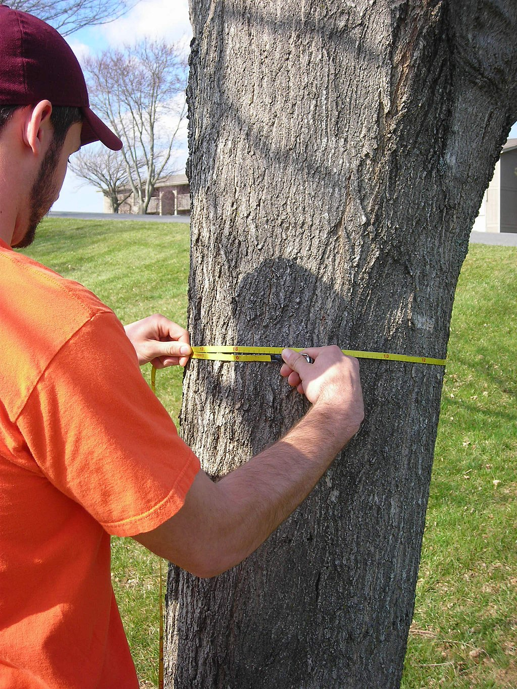

```{r include=FALSE, cache=FALSE}

library("knitr")

### Chunk options ###

## Text results
opts_chunk$set(echo = FALSE, warning = FALSE, message = FALSE, size = 'tiny')

## Code decoration
opts_chunk$set(tidy = FALSE, comment = NA, highlight = TRUE, prompt = FALSE, crop = TRUE)

# ## Cache
# opts_chunk$set(cache = TRUE, cache.path = "knitr_output/cache/")

# ## Plots
# opts_chunk$set(fig.path = "knitr_output/figures/")
opts_chunk$set(fig.align = 'center', out.width = '90%')

### Hooks ###
## Crop plot margins
knit_hooks$set(crop = hook_pdfcrop)

## Reduce font size
## use tinycode = TRUE as chunk option to reduce code font size
# see http://stackoverflow.com/a/39961605
knit_hooks$set(tinycode = function(before, options, envir) {
  if (before) return(paste0("\n \\", options$size, "\n\n"))
  else return("\n\n \\normalsize \n")
  })

```


```{r}
library(ggplot2)

set.seed(88)
```


## Measure trunk diameter of 30 trees in your neighbourhood

```{r}

```

```{r echo=FALSE}
library(dplyr)
treediam <- data.frame(site = rep(1:20, each = 30)) %>% 
  group_by(site) %>% 
  mutate(tree = seq_len(30),
         diam = round(rnorm(30, 25, 5), 1))
```


## Read data

```{r echo = TRUE, eval=FALSE}
treediam <- read.csv("treediam.csv")
```

```{r echo=TRUE}
summary(treediam)
```


## Visualisation of tree diameters

```{r echo = TRUE}
plot(treediam$diam)
```


## Visualisation of tree diameters

```{r echo = TRUE}
hist(treediam$diam)
```


---

\Large

How well do these values

represent actual tree diameters

in your neighbourhood?

\vspace{1cm}

\normalsize 

https://pollev.com/franciscorod726


---

\large

- At what height did you measure?

- Did you include bark?

- Did you measure with tape, caliper, by eye?

- When did you measure: dawn, midday, night? 

  - (trees may get thinner w/ high evapotranspiration)

- Where did you measure? 

  - (differences among streets, species, etc)


---

Data are hardly ever objective. 

We decide **what to measure, when, where, and how**.

\vspace{1cm}

Always consider: 

**How well do data reflect what we are trying to measure?**


## How would you describe this distribution?

```{r}
hist(treediam$diam)
```

(Discuss with your partner)


# Location / Central tendency

## Mean / Average

mean = $\dfrac {d_{1} + d_{2} + d_{3}} {n}$

```{r}
hist(treediam$diam)
abline(v = mean(treediam$diam), lwd = 8, col = "red")
```


## Mean is sensitive to skew/outliers

```{r}
vec <- c(rnorm(50, 20, 5), 500, 500, 500)
# vec <- rlnorm(500, 3, 3)
hist(vec, breaks = 100, main = "", xlab = "")
abline(v = mean(vec), lwd = 8, col = "red")
```


## Median

50% percentile. Leaves half of the data values on each side

```{r out.width="80%"}
vec <- rlnorm(50, 3, 1)
hist(vec, breaks = 100, main = "Red = Mean\nBlue = Median", xlab = "")
abline(v = median(vec), lwd = 5, col = "blue")
abline(v = mean(vec), lwd = 5, col = "red")
```

\footnotesize

Median of c(2, 4, **6**, 8, 10) = 6

Median of c(2, 4, 6, 8) = (4 + 6) / 2 = 5


## Mode

Most frequent value

```{r}
vals <- c(3, 4, 4, 4, 4, 5, 5, 8, 10)
hist(vals, breaks = 1:10, main = "Mode = 4", xlab = "")
```


## Describing the location / central tendency

```{r}
set.seed(88)
logvec <- data.frame(vec = rlnorm(1000, 3, 0.7))
ggplot(logvec) +
  theme_minimal() +
  geom_histogram(aes(vec), size = 2, fill = "grey80") +
  geom_vline(xintercept = mean(logvec$vec), lwd = 1, col = "red") +
  geom_vline(xintercept = median(logvec$vec), lwd = 1, col = "blue") +
  labs(x = "", y = "") +
  annotate("text", x = 6, y = 230, label = "Mode", size = 6) +
  annotate("text", x = 10, y = 40, label = "Median", colour = "blue", size = 6) +
  annotate("text", x = 35, y = 40, label = "Mean", colour = "red", size = 6)
```


# Describing Variation / Spread

## Minimum, Maximum, Range

```{r}
hist(treediam$diam, main = "", xlab = "")
```

\footnotesize

Minimum = 9.2

Maximum = 41.9

Range = 9.2, 41.9


## Quantiles

Quartiles, Percentiles...

```{r}
p75 <- quantile(logvec$vec, probs = 0.75)
ggplot(logvec) +
  geom_density(aes(vec), size = 2, fill = "grey") +
  theme_minimal() +
  geom_vline(xintercept = p75, colour = "red", lwd = 2) +
  annotate("text", x = 45, y = 0.03, label = "Percentile 75", colour = "red", hjust = 0, size = 6) +
  annotate("text", x = 45, y = 0.025, label = "75% of data to the left\n25% to the right", 
           colour = "red", size = 5, hjust = 0)
```


## Standard Deviation

Average distance between data points and the mean

\vspace{1cm}

$SD = \sqrt {\dfrac {\sum \left( x-\mu\right) ^{2}}{n-1}}$


## In a Normal distribution

```{r}
include_graphics("images/gaussian.png")
```


## Standard Error of the Mean

$SEM = \dfrac{SD} {\sqrt{n}}$

\vspace{1cm}

Estimates uncertainty (spread) of the parameter 'mean'


## Relationship between SD and SEM

:::::::::::::: {.columns align=center .onlytextwidth}

::: {.column width="50%"}
```{r echo=FALSE, out.height='3in', out.width='2in'}
include_graphics("images/SD-SEM.PNG")
```
:::

::: {.column width="50%"}

\footnotesize

- SD quantifies scatter in population

- SEM quantifies uncertainty in parameter estimate (population mean)

- SEM = SD/sqrt(n)

- SEM decreases with sample size (mean better known), SD does not.

- https://gallery.shinyapps.io/sampling_and_stderr/

:::
::::::::::::::


## Coefficient of Variation 

\footnotesize

Facilitates comparing spread of distributions with different means

$CV = \dfrac{SD} {mean}$


```{r out.width="80%"}
d1 <- rnorm(100, 20, 5)
d2 <- rnorm(100, 100, 5)
df <- data.frame(d1 = d1, d2 = d2)
ggplot(df) +
  geom_density(aes(d1), fill = "grey90") +
  geom_density(aes(d2), fill = "grey90") +
  theme_minimal() +
  scale_x_continuous(limits = c(-10, 130)) +
  labs(x = "", y = "") +
  theme(axis.text.y = element_blank(),
        axis.text.x = element_text(size = 14)) +
  annotate("text", x = 30, y = 0.07, 
           label = "Mean = 20\nSD = 5\nCV = 0.25", hjust = 0, size = 5) +
    annotate("text", x = 65, y = 0.03, 
           label = "Mean = 100\nSD = 5\nCV = 0.05", hjust = 0, size = 5)
```


## Summarise a distribution

:::::::::::::: {.columns align=center .onlytextwidth}

::: {.column width="70%"}
### Central tendency / location

  - mean (average)

  - median (50% percentile)

  - mode (most frequent value)


### Variation / Spread

  - min, max, range

  - quantiles 
      (quartiles, percentiles...)

  - standard deviation

  - standard error of the mean

  - coefficient of variation 

:::

::: {.column width="30%" align=top}
```{r out.width='1in', out.height='1in'}
hist(treediam$diam)
```
:::
::::::::::::::


## What statistical descriptors are best? (and why)

https://pollev.com/franciscorod726

```{r echo = FALSE}
par(mfrow = c(1,2))
data <- c(rnorm(100, 165, 5), 200, 210, 220, 220, 250)
hist(data, col = "grey")

data <- c(rep(0, 22), rep(1, 16))
hist(data, col = "grey")
par(mfrow = c(1,1))
```


