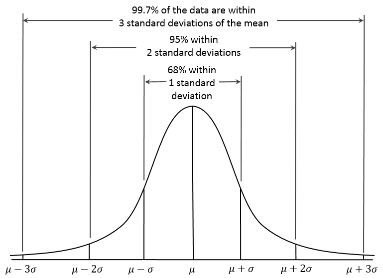

```{r include=FALSE, cache=FALSE}

library("knitr")

### Chunk options ###

## Text results
opts_chunk$set(echo = FALSE, warning = FALSE, message = FALSE, size = 'tiny')

## Code decoration
opts_chunk$set(tidy = FALSE, comment = NA, highlight = TRUE, prompt = FALSE, crop = TRUE)

# ## Cache
# opts_chunk$set(cache = TRUE, cache.path = "knitr_output/cache/")

# ## Plots
# opts_chunk$set(fig.path = "knitr_output/figures/")
opts_chunk$set(fig.align = 'center', out.width = '4in', out.height = '3in')

### Hooks ###
## Crop plot margins
knit_hooks$set(crop = hook_pdfcrop)

## Reduce font size
## use tinycode = TRUE as chunk option to reduce code font size
# see http://stackoverflow.com/a/39961605
knit_hooks$set(tinycode = function(before, options, envir) {
  if (before) return(paste0("\n \\", options$size, "\n\n"))
  else return("\n\n \\normalsize \n")
  })

```


# Guess my age

```{r echo = FALSE}
age <- rnorm(25, 35, 2)
age <- c(27, 32, 29, 34, 32, 31, 33, 36, 35, 30, 33, 33, 34, 32, 34, 34, 34, 35, 35)
```


## Graph your estimates

```{r}
hist(age)
```


## Do you think these data are good estimates of my age?

https://pollev.com/franciscorod726

```{r out.height='2in', out.width='2in', echo=FALSE}
hist(age)
```

Why / Why not?


---

Data are hardly ever objective. 

We decide **what to measure, when, where, and how**.

Always consider: 

How well do these numbers reflect what we are trying to measure?


## Summarise that distribution

:::::::::::::: {.columns align=center .onlytextwidth}

::: {.column width="60%"}
### Central tendency / location

  - mean: 
  $\dfrac {a_{1} + a_{2} + a_{3}} {n}$

  - median (50% percentile)

  - mode (most frequent value)


### Variation / Spread

  - min, max, range

  - quantiles 
      (quartiles, percentiles...)

  - standard deviation: 
  $SD = \sqrt {\dfrac {\sum \left( x-\mu\right) ^{2}}{n-1}}$

  - standard error:
  $SEM = \dfrac{SD} {\sqrt{n}}$

  - coefficient of variation (CV = SD / mean)

  - confidence intervals

:::

::: {.column width="40%" align=center}
```{r out.width='1in', out.height='1in'}
hist(age)
```
:::
::::::::::::::


## Relationship between SD and SEM

:::::::::::::: {.columns align=center .onlytextwidth}

::: {.column width="50%"}
```{r echo=FALSE, out.height='3.5in', out.width='2.3in'}

```
:::

::: {.column width="50%"}

- SD quantifies scatter in population

- SEM quantifies uncertainty in parameter estimate (population mean)

- SEM = SD/sqrt(n)

- SEM decreases with sample size (mean better known), SD does not.

- https://gallery.shinyapps.io/sampling_and_stderr/

:::
::::::::::::::


## In a Normal distribution




## What statistical descriptors are best? (and why)

https://pollev.com/franciscorod726

```{r echo = FALSE}
par(mfrow = c(1,2))
data <- c(rnorm(100, 165, 5), 200, 210, 220, 220, 250)
hist(data, col = "grey")

data <- c(rep(0, 22), rep(1, 16))
hist(data, col = "grey")
par(mfrow = c(1,1))
```


