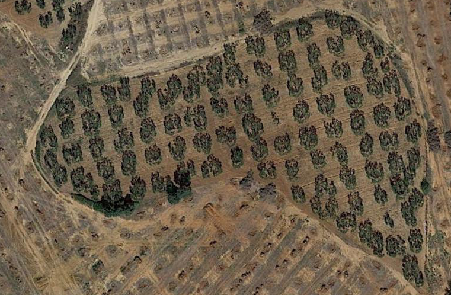
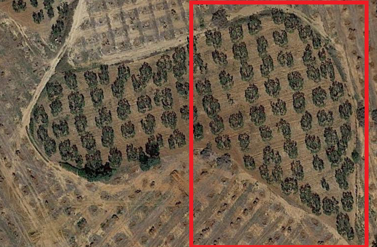
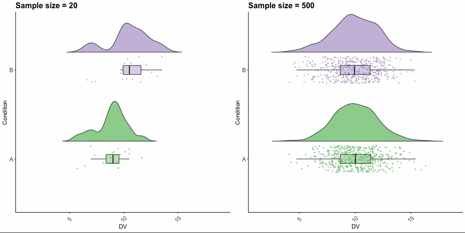
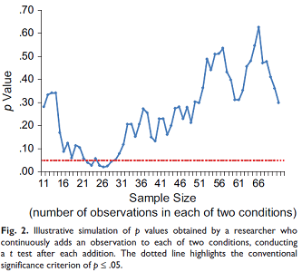

```{r include=FALSE, cache=FALSE}

library(rmarkdown)
library(knitr)

### Chunk options ###

## Text results
opts_chunk$set(echo = TRUE, warning = FALSE, message = FALSE)

## Code decoration
opts_chunk$set(tidy = FALSE, comment = NA, highlight = TRUE)

# ## Cache
opts_chunk$set(cache = 2, cache.path = "knitr_output/cache/")

# ## Plots
opts_chunk$set(fig.path = "knitr_output/figures/", fig.align = 'center')


```


## How would you evaluate fertilizer effect?

Discuss with partner (5')




# Experimental design principles

# Replication

## Replication!




## Replication

- Replication is key: we need several samples.

- How many? As much as you can! See [Gelman & Carlin 2014](https://doi.org/10.1177/1745691614551642).

- Traditionally, ecology studies have had too low sample sizes. 

- Low sample sizes miss subtle effects, but also [prone to bias](http://science.sciencemag.org/content/355/6325/584.summary).


## Low sample sizes very sensitive to random noise

[](https://video.twimg.com/tweet_video/DifncYiX0AEnn19.mp4)

https://twitter.com/ajstewart_lang/status/1020038488278945797


## Sample size is very important

See [*The evolution of correlations*](http://vimeo.com/57127001)

Stopping rules:




## Sample size estimation

- Plan model **before** data collection.

- Do simulations. Power/Sample size analyses ([e.g.](https://doi.org/10.1111/2041-210X.12504)).

- Plan to have at least **10-30 observations per predictor**.

- Complex models (w/ many predictors, interactions etc) require **high** sample sizes.


# Randomization

## Randomization


## Randomization

- Haphazard $\neq$ Random

- Stratify: randomize within groups (e.g. species, soil types)


# Controls

## Have controls

- Untreated individuals, plots... (assigned randomly, of course).

- Must differ only in treatment (i.e. homogeneous environment).

- Measure before & after treatment.

- Consider blind designs to avoid observer bias.


## Experimental design principles

1. Replication

2. Randomization

3. Controls


## To read more

- [Ruxton & Colegrave. Experimental Design for the Life Sciences. OUP](http://global.oup.com/ukhe/product/experimental-design-for-the-life-sciences-9780198717355?cc=es&lang=en&)


