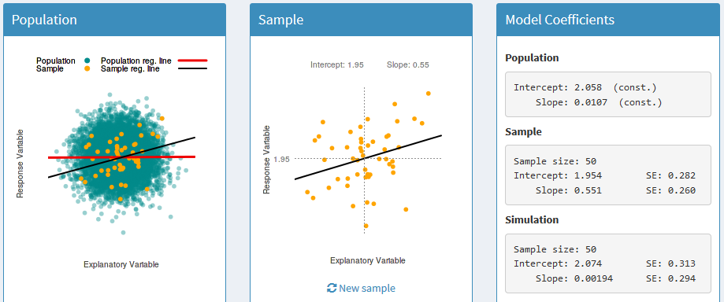

```{r include=FALSE, cache=FALSE}

library("knitr")

### Chunk options ###

## Text results
opts_chunk$set(echo = FALSE, warning = FALSE, message = FALSE, size = 'tiny')

## Code decoration
opts_chunk$set(tidy = FALSE, comment = NA, highlight = TRUE, prompt = FALSE, crop = TRUE)

# ## Cache
# opts_chunk$set(cache = TRUE, cache.path = "knitr_output/cache/")

# ## Plots
# opts_chunk$set(fig.path = "knitr_output/figures/")
opts_chunk$set(fig.align = 'center', out.width = '4in', out.height = '3in')

### Hooks ###
## Crop plot margins
knit_hooks$set(crop = hook_pdfcrop)

## Reduce font size
## use tinycode = TRUE as chunk option to reduce code font size
# see http://stackoverflow.com/a/39961605
knit_hooks$set(tinycode = function(before, options, envir) {
  if (before) return(paste0("\n \\", options$size, "\n\n"))
  else return("\n\n \\normalsize \n")
  })

```


## How would you evaluate fertilizer effect?

Discuss with partner (5')


# Experimental design principles

# Replication

## Replication!


## Replication

- Replication is key: we need several samples.

- How many? As much as you can! See [Gelman & Carlin 2014](https://doi.org/10.1177/1745691614551642).

- Traditionally, ecology studies have had **too low sample sizes**. 

- Low sample sizes miss subtle effects, but also [**prone to bias**](http://science.sciencemag.org/content/355/6325/584.summary).


## Low sample sizes very sensitive to random noise

[](https://video.twimg.com/tweet_video/DifncYiX0AEnn19.mp4)

https://twitter.com/ajstewart_lang/status/1020038488278945797


## Low sample sizes may bias inferences about population



http://statisticalgate.com/regression-simulation/


## Low sample sizes may bias inferences

See [*The evolution of correlations*](http://vimeo.com/57127001)

**Stopping rules**

```{r echo=FALSE, out.height='3in', out.width='3in'}
include_graphics("images/ssize-pvalue.png")
```


## Sample size estimation

- Plan model/statistical analysis **before** data collection.

- **Do simulations**. Power/Sample size/Precision analyses (e.g.[this](https://doi.org/10.1136/bmj.m441), [this](https://doi.org/10.1111/2041-210X.12504) or [this](https://precisely.malco.io/)).

- Plan to have at least **10-30 observations per predictor**.

- Complex models (w/ many predictors, interactions etc) require **high** sample sizes.


# Randomization

## Randomization


## Randomization

- Haphazard $\neq$ Random

- Stratify: randomize within groups (e.g. species, soil types)


# Controls

## Have controls

- Untreated individuals, plots... (assigned randomly, of course).

- **Must differ only in treatment** (i.e. homogeneous environment).

- Measure **before & after** treatment.

- Consider **blind designs** to avoid observer bias.


## Experimental design principles

1. Replication

2. Randomization

3. Controls


## To read more

- [Ruxton & Colegrave. Experimental Design for the Life Sciences. OUP](http://global.oup.com/ukhe/product/experimental-design-for-the-life-sciences-9780198717355?cc=es&lang=en&)


