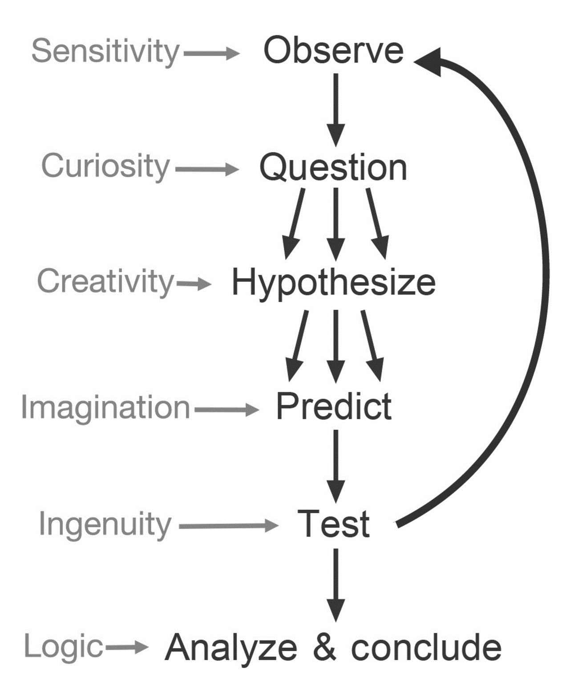

```{r include=FALSE, cache=FALSE}

library(rmarkdown)
library(knitr)

### Chunk options ###

## Text results
opts_chunk$set(echo = FALSE, warning = FALSE, message = FALSE)

## Code decoration
opts_chunk$set(tidy = FALSE, comment = NA, highlight = TRUE)

# ## Cache
opts_chunk$set(cache = 2, cache.path = "knitr_output/cache/")

# ## Plots
opts_chunk$set(fig.path = "knitr_output/figures/", fig.align = 'center')


```


# NHST concepts


## Null and alternative hypotheses

- Tell me...

- **Null hypothesis**: there is no difference between groups. 

- **Alternative hypothesis**: groups are different.


## In ecology, everything is somewhat different

```{r echo=FALSE, out.height='3in', out.width='4in'}
include_graphics("images/Abrain_nonsense.png")
```

## What is the p-value?

https://pollev.com/franciscorod726


## **P value**

- Very complicated concept: even statisticians fail to describe it well.

- Probability of observing data as or more extreme than these *if H0 was true*.

- Low P-value: data unlikely if H0 was true.

- Large P-value: data not unusual if H0 was true.


## Are differences *significant*?

- If p < 0.05, we **reject** H0.

- If p > 0.05, we **fail to reject** H0

- (which is **NOT** the same as 'H0 is true')

- **CAUTION:**

- This is **very widespread, but incorrect** practice.

- P-value is continuous. We must **avoid binary decisions** based on **arbitrary thresholds**.

- More on this later.


## Let's do the test

```{r echo=FALSE}
h.sevi <- round(rnorm(5, 170, 10))
h.out <- round(rnorm(10, 178, 10))
```

```{r echo = TRUE}
t.test(h.sevi, h.out)
```

**Are heights different then?**


## Rejecting hypotheses: two types of error


## Rejecting hypotheses: two types of error


 
**Power**: Probability of detecting true difference (rejecting H0 when it's false).


## Understanding NHST

http://rpsychologist.com/d3/NHST/


## Example: biased coin

```{r coin, echo = 4}
ntrials <- 10
coin <- rbinom(ntrials, 1, 0.6)
coin

test <- prop.test(sum(coin), ntrials)
test
```


## Correlation between variables

http://rpsychologist.com/d3/correlation/


# Common pitfalls and good practice

## A must read

```{r out.height='3in', out.width='4in'}

```

https://doi.org/10.1007/s10654-016-0149-3


## Good read


https://doi.org/10.1890/ES13-00160.1

Also http://www.statisticsdonewrong.com/


## Good read

```{r out.height='3in', out.width='2in'}
include_graphics("images/Sutherland_tips.png")
```

https://doi.org/10.1038/503335a


# Visualisation of data and models is key 

## First things first

- Always 

- Always 

- Always


## Plot data and models


## Don't use statistics blindly: *Visualise*

```{r out.height='3in', out.width='4in'}
include_graphics("images/correlations.png")
```

https://janhove.github.io/teaching/2016/11/21/what-correlations-look-like


## Don't use statistics blindly: *Visualise*

```{r out.height='3in', out.width='4in'}
include_graphics("images/correlations2.png")
```

https://janhove.github.io/teaching/2016/11/21/what-correlations-look-like


## Don't use statistics blindly: *Visualise*

```{r out.height='3in', out.width='4in'}
include_graphics("images/correlations3.png")
```

https://janhove.github.io/teaching/2016/11/21/what-correlations-look-like


----

> **Plot. Check models. Plot. Check assumptions. Plot.**

[Lavine 2014 *Ecology*](http://dx.doi.org/10.1890/13-1112.1)


# Inference from observational studies


## News: Hamburgers increase risk of heart attack

- In a sample of 10,000 people, it was found that people eating >2 hamburgers a week had 20% higher probability of heart attack.

- **Do hamburgers increase heart attacks?**

- https://pollev.com/franciscorod726


## Bigger flowers increase reproductive success

- We found that plants with big flowers produced 30% more seeds...

- **Do big flowers increase reproductive success?**

- https://pollev.com/franciscorod726


## Correlation vs Causation


http://tylervigen.com/spurious-correlations


## Learning statistics through xkcd

```{r out.height='3in', out.width='4in'}
include_graphics("images/xkcd_correlation.png")
```


# NHST and p-values

## In ecology, everything is somewhat different

```{r echo=FALSE, out.height='3in', out.width='4in'}
include_graphics("images/Abrain_nonsense.png")
```


## Instead of falsifying a null model, estimate effects and compare meaningful models

```{r echo=FALSE, out.height='3in', out.width='3in'}

```

https://doi.org/10.1242/jeb.104976


## P-value depends on sample size

```{r out.height='3in', out.width='4in'}
include_graphics("images/pvalue_SS_Motulski.jpg")
```

https://doi.org/10.1002/prp2.93


## P-value depends on sample size

- Same real difference is detected as significant or not depending on sample size:


## Statistically significant != biologically important

- With big sample size, we can find **highly significant but biologically unimportant** differences.

```{r out.height='3in', out.width='4in'}
include_graphics("images/bigSS.png")
```


## Statistically significant != biologically important

- Statistically significant = unlikely to be zero

- Good read: [*significantly misleading*](http://www.statslife.org.uk/the-statistics-dictionary/1000-the-statistics-dictionary-significantly-misleading)

- My suggestion: avoid significant/not significant (and maybe p-values too)

- Beyond significance, look at *effect sizes*.


## 'Not significant' does NOT mean 'there is no effect'


- **Absence of evidence != Evidence of absence**


## Failure to reject H0 != H0 is true


## p-value > 0.05?

- "We were **unable to find evidence** against the hypothesis that A = B **with the current sample size**" ([Harrell](https://discourse.datamethods.org/t/language-for-communicating-frequentist-results-about-treatment-effects/934))

- "Differences between groups were **not statistically clear**" ([Dushoff et al](https://doi.org/10.1111/2041-210X.13159))


## Is it safe to allow right turn with red lights?

- Right turn not allowed: 308 accidents

- Right turn allowed: 337 accidents

- No *significant* difference, hence safe

- Misinterpretation of underpowered study cost lives

https://www.statisticsdonewrong.com/power.html#the-wrong-turn-on-red


## 0.05 is an arbitrary threshold


http://dx.doi.org/10.1198/000313006X152649


## Multiple hypothesis testing


## How to make your results significant: *p-hacking*

```{r out.height='3in', out.width='5in'}
include_graphics("images/phacking_Motulski.jpg")
```

http://dx.doi.org/10.1002/prp2.93


## How to make your results significant: *p-hacking*

1. Test multiple variables, then report the ones that are significant.

2. Artificially choose when to end your experiment.

3. Add covariates until effects are significant.

4. Test different conditions (e.g. different levels of a factor) and report the ones you like.

- To read more: [Simmons et al 2011](http://papers.ssrn.com/sol3/papers.cfm?abstract_id=1850704)


## How to make your results significant: *p-hacking*

https://www.youtube.com/watch?v=ZaNtz76dNSI


## ASA statement on p-values

- P-values do not measure the **probability of hypothesis** being true, or the probability that the data were produced by **random chance** alone.

- Scientific conclusions or policy decisions should NOT be based only on **whether a
p-value passes a specific threshold**.

- P-value, or statistical significance, does not measure the **size of an effect** or the **importance** of a result.

- By itself, a p-value does NOT provide a good **measure of evidence** regarding a model or hypothesis.


https://doi.org/10.1080/00031305.2016.1154108


## The New Statistics

Aim for estimation of effects and their uncertainty (SE, CI...)


http://dx.doi.org/10.1177/0956797613504966


## How many types of errors?

- **Type I**: False positive (incorrect rejection of null hypothesis).

- **Type II**: False negative (failure to reject false null hypothesis).

- **Type S (Sign)**: estimating effect in opposite direction.

- **Type M (Magnitude)**: Misestimating magnitude of the effect (under or overestimating).

- [Beyond Power Calculations: Assessing 
Type S (Sign) and Type M (Magnitude) 
Errors](http://www.stat.columbia.edu/~gelman/research/published/retropower_final.pdf)


