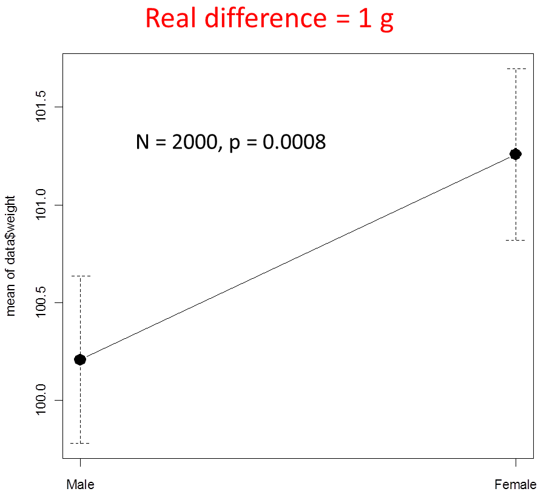

```{r include=FALSE, cache=FALSE}

library("knitr")

### Chunk options ###

## Text results
opts_chunk$set(echo = FALSE, warning = FALSE, message = FALSE, size = 'tiny')

## Code decoration
opts_chunk$set(tidy = FALSE, comment = NA, highlight = TRUE, prompt = FALSE, crop = TRUE)

# ## Cache
# opts_chunk$set(cache = TRUE, cache.path = "knitr_output/cache/")

# ## Plots
# opts_chunk$set(fig.path = "knitr_output/figures/")
opts_chunk$set(fig.align = 'center', out.width = '90%')

### Hooks ###
## Crop plot margins
knit_hooks$set(crop = hook_pdfcrop)

## Reduce font size
## use tinycode = TRUE as chunk option to reduce code font size
# see http://stackoverflow.com/a/39961605
knit_hooks$set(tinycode = function(before, options, envir) {
  if (before) return(paste0("\n \\", options$size, "\n\n"))
  else return("\n\n \\normalsize \n")
  })

```


# NHST concepts


## Null and alternative hypotheses

- Tell me...

- **Null hypothesis**: there is no difference between groups. 

- **Alternative hypothesis**: groups are different.


## In biology, everything is somewhat different

```{r echo=FALSE, out.width='95%'}

```

## What is the p-value?

- The probability that the observed data were produced by chance 

- The probability of getting results at least as extreme as observed if H0 was true

- The probability of null hypothesis being true

- The probability of alternative hypothesis being true

https://pollev.com/franciscorod726


## P-value

- Very complicated concept: even statisticians fail to describe it well.

- Probability of observing data as or more extreme than these *if every model assumption were correct*

- What assumptions?

  - Null hypothesis is true
  
  - No uncontrolled sources of bias (measurement or programming error, p-hacking, etc)
  

## A very small p-value does NOT mean H0 is automatically false

- A [famous experiment](https://peerj.com/blog/post/115284880344/inferential-statistics-p-values-and-the-quest-to-evaluate-evidence-and-hypotheses/) found neutrinos faster than light 

- p-value < 10^-7^ -> reject null hypothesis of equal speed

- In reality, measurement error (loose cable)


## How to interpret P-values

- **Low P-value**: data unlikely if every model assumption (including H0) were true.

- **Large P-value**: data not unusual if every model assumption (including H0) were true.

- A very small P-value does not tell us which model assumption is incorrect:

  - Could be that H0 is not true
  
  - But also that some auxiliary assumption is not true (e.g. sampling not random, measurement error, p-hacking...)
  
- See [Greenland et al 2016](https://doi.org/10.1007/s10654-016-0149-3)


## If p-value > 0.05

- the null hypothesis is false, i.e. the alternative hypothesis must be true

- the alternative hypothesis is false, i.e. the null hypothesis must be true

- it's unclear if there are differences between groups

- there is no difference between groups

https://pollev.com/franciscorod726


## Are differences "significant"?

Common practice:

- If p < 0.05, we **reject** H0.

- If p > 0.05, we **fail to reject** H0

- (which is **NOT** the same as 'H0 is true')

- **CAUTION:** P-value is continuous. We'd rather **avoid binary decisions** based on **arbitrary thresholds**.

. . . 

```{r out.height='1in', out.width='3in'}

```

\footnotesize https://doi.org/10.1038/d41586-019-00857-9


## Are these two groups different?

\footnotesize 

```{r echo=FALSE}
group.A <- round(rnorm(5, 170, 10))
group.B <- round(rnorm(10, 178, 10))
```

```{r echo = TRUE}
t.test(group.A, group.B)
```

https://pollev.com/franciscorod726


## Rejecting hypotheses: two types of error


## Rejecting hypotheses: two types of error


 
\footnotesize POWER: Probability of detecting true difference (rejecting H0 when it's false).


## Is this coin biased?

\footnotesize

```{r coin, echo = 4}
ntrials <- 10
coin <- rbinom(ntrials, 1, 0.6)
coin

test <- prop.test(sum(coin), ntrials)
test
```

https://pollev.com/franciscorod726


## Understanding NHST

http://rpsychologist.com/d3/NHST/

http://daniellakens.blogspot.com/2017/12/understanding-common-misconceptions.html


# NHST and p-values:\newline common pitfalls


---

\Huge A significant p-value\newline does NOT mean\newline we found a true difference


## A significant p-value does not mean we found a true difference

Particularly with low sample sizes

```{r out.width="95%"}
library(ggplot2)
library(patchwork)

set.seed(8)
xdist <- rnorm(1000, 50, 15)
ydist <- rnorm(1000, 50, 15)
dist <- data.frame(group = rep(c("A", "B"), each = 1000), 
                   value = c(xdist, ydist))
p1 <- ggplot(dist) +
  geom_density(aes(value, fill = group), alpha = 0.3) +
  theme_minimal() +
  coord_cartesian(xlim = c(0, 100)) +
  labs(title = "Two groups have same distribution") 

xsamp <- sample(xdist, 10)
ysamp <- sample(ydist, 10)
samp <- data.frame(group = rep(c("A", "B"), each = 10),
                   value = c(xsamp, ysamp))

tt <- t.test(xsamp, ysamp)

p2 <- ggplot(samp) +
  geom_histogram(aes(value, fill = group)) +
  theme_minimal() +
  coord_cartesian(xlim = c(0, 100)) +
  labs(title = "Sampling 10 individuals from each group and making t-test",
       y = "count") +
  annotate("text", x = 70, y = 3, hjust = 0, size = 8,
           label = paste0("p = ", round(tt$p.value, 3)))

p1/p2

# m <- lm(vals ~ samp, data = samp)
# summary(m)
# visreg::visreg(m)
```


## If sample size was larger...


```{r out.width="100%"}

set.seed(8)
xdist <- rnorm(1000, 50, 15)
ydist <- rnorm(1000, 50, 15)
dist <- data.frame(group = rep(c("A", "B"), each = 1000), 
                   value = c(xdist, ydist))
p1 <- ggplot(dist) +
  geom_density(aes(value, fill = group), alpha = 0.3) +
  theme_minimal() +
  coord_cartesian(xlim = c(0, 100)) +
  labs(title = "Two groups have same distribution") 

xsamp <- sample(xdist, 500)
ysamp <- sample(ydist, 500)
samp <- data.frame(group = rep(c("A", "B"), each = 500),
                   value = c(xsamp, ysamp))

tt <- t.test(xsamp, ysamp)

p2 <- ggplot(samp) +
  geom_histogram(aes(value, fill = group)) +
  theme_minimal() +
  coord_cartesian(xlim = c(0, 100)) +
  labs(title = "Sampling 500 individuals from each group and making t-test",
       y = "count") +
  annotate("text", x = 75, y = 80, hjust = 0, size = 8,
           label = paste0("p = ", round(tt$p.value, 3)))

p1/p2

```


---

\Large
With low sample size (power),\newline significant p-values\newline are most likely overestimates

\vspace{1cm}

\raggedright 
\footnotesize [Loken & Gelman 2014](https://doi.org/10.1126/science.aal3618), [Vasisth et al. 2018](https://doi.org/10.1016/j.jml.2018.07.004)
\raggedleft


## P-value depends on sample size

```{r }

```

\footnotesize https://doi.org/10.1002/prp2.93


## P-value depends on sample size

Same real difference is detected as **significant or not depending on sample size**


---

\Huge
Statistically significant\newline !=\newline biologically important

## Statistically significant != biologically important

With big sample size, we can find **highly significant but biologically unimportant** differences.

```{r out.height='2.5in', out.width='3.5in'}

```


## Statistically significant != biologically important

```{r out.width="40%", fig.align='left'}

```


:::::::::::::: {.columns align=center}

::: {.column width="50%"}
```{r out.width="100%"}

```
:::

::: {.column width="50%" }
```{r out.width="100%"}

```
:::
::::::::::::::

\tiny https://twitter.com/weinberz/status/1422405165236178947?s=20


## Statistically significant != biologically important

```{r}
set.seed(1)
x <- rnorm(10000,0,1)
y <- rnorm(10000,0,1) + x/44
plot(x,y,col=rgb(.5,0,0,.25),pch=19,cex=.5, main = "p = 0.005", cex.main = 3)
abline(lm(y~x),lwd=2)
#https://twitter.com/CaAl/status/908322681958920192?s=20
```


## Statistically significant != biologically important

- Statistically significant = unlikely to be zero

- Good read: [*significantly misleading*](https://web.archive.org/web/20150911003128/https://www.statslife.org.uk/the-statistics-dictionary/1000-the-statistics-dictionary-significantly-misleading)

- Beyond significant/not significant, look at **effect sizes and their uncertainty**.


---

\Huge
'Not significant'\newline does NOT mean\newline 'there is no effect'


## 'Not significant' does NOT mean 'they are equal'

```{r out.width="100%"}

set.seed(8)
xdist <- rnorm(1000, 70, 15)
ydist <- rnorm(1000, 50, 15)
dist <- data.frame(group = rep(c("A", "B"), each = 1000), 
                   value = c(xdist, ydist))
p1 <- ggplot(dist) +
  geom_density(aes(value, fill = group), alpha = 0.3) +
  theme_minimal() +
  coord_cartesian(xlim = c(0, 100)) +
  labs(title = "Two groups have different distribution") 

xsamp <- sample(xdist, 10)
ysamp <- sample(ydist, 10)
samp <- data.frame(group = rep(c("A", "B"), each = 10),
                   value = c(xsamp, ysamp))

tt <- t.test(xsamp, ysamp)

p2 <- ggplot(samp) +
  geom_histogram(aes(value, fill = group)) +
  theme_minimal() +
  coord_cartesian(xlim = c(0, 100)) +
  labs(title = "Sampling 10 individuals from each group and making t-test",
       y = "count") +
  annotate("text", x = 75, y = 3, hjust = 0, size = 8,
           label = paste0("p = ", round(tt$p.value, 3)))

p1/p2

```


## 'Not significant' does NOT mean 'there is no effect'

```{r}
p1 <- ggplot(dist) +
  geom_violin(aes(group, value, fill = group), 
              alpha = 0.3, show.legend = FALSE) +
  theme_minimal(base_size = 15) +
  labs(title = "True distributions",
  subtitle = "Difference of means = 20", x = "", y = "") +
  coord_cartesian(ylim = c(0, 120))

p2 <- ggplot(samp) +
  geom_violin(aes(group, value, fill = group), 
              alpha = 0.3, show.legend = FALSE) +
  theme_minimal(base_size = 15) +
  labs(title = "Samples",
  subtitle = paste0("p = ", round(tt$p.value, 3)),
  y = "", x = "") +
  coord_cartesian(ylim = c(0, 120))

p1 + p2

```

---

\Large
Failure to reject H0 != H0 is true

Absence of evidence != Evidence of absence


## p-value > 0.05?

- "We were **unable to find evidence** against the hypothesis that A = B **with the current sample size**" ([Harrell](https://discourse.datamethods.org/t/language-for-communicating-frequentist-results-about-treatment-effects/934))

- "Differences between groups were **not statistically clear**" ([Dushoff et al](https://doi.org/10.1111/2041-210X.13159))


## Is it safe to allow right turn with red lights?

:::::::::::::: {.columns align=center}

::: {.column width="70%"}
- Right turn not allowed: 308 accidents

- Right turn allowed: 337 accidents

- No *significant* difference, hence safe

- Failure to reject H0 does NOT mean H0 is true!

- Misinterpretation of underpowered study cost lives
:::

::: {.column width="30%" }
```{r echo=FALSE}
include_graphics("images/turn-red.png")
```
:::
::::::::::::::

https://www.statisticsdonewrong.com/power.html#the-wrong-turn-on-red


## 0.05 is an arbitrary threshold


http://dx.doi.org/10.1198/000313006X152649


## Multiple hypothesis testing

```{r out.width="100%"}
include_graphics("images/xkcd_testing.png")
```

\tiny https://xkcd.com/882

## How to make your results significant: *p-hacking*

```{r out.height='3in', out.width='5in'}

```

\tiny http://dx.doi.org/10.1002/prp2.93


## How to make your results significant: *p-hacking*

\footnotesize

1. Test multiple variables, then report the ones that are significant.

2. Artificially choose when to end your experiment.

3. Add covariates until effects are significant.

4. Test different conditions (e.g. different levels of a factor) and report the ones you like.

- To read more: [Simmons et al 2011](http://papers.ssrn.com/sol3/papers.cfm?abstract_id=1850704)


## p-hacking: try it yourself

https://www.shinyapps.org/apps/p-hacker/

https://shiny.psy.lmu.de/felix/ShinyPHack/


## How to make your results significant: *p-hacking*

https://www.youtube.com/watch?v=ZaNtz76dNSI


## ASA statement on p-values

\footnotesize

- P-values do not measure the **probability of hypothesis** being true, or the probability that the data were produced by **random chance** alone.

- Scientific conclusions or policy decisions should NOT be based only on **whether a
p-value passes a specific threshold**.

- P-value, or statistical significance, does not measure the **size of an effect** or the **importance** of a result.

- By itself, a p-value does NOT provide a good **measure of evidence** regarding a model or hypothesis.


https://doi.org/10.1080/00031305.2016.1154108


# Good practice


## A must read

```{r out.height='3in', out.width='4in'}
include_graphics("images/Greenland.PNG")
```

https://doi.org/10.1007/s10654-016-0149-3


## Good read


https://doi.org/10.1890/ES13-00160.1

Also http://www.statisticsdonewrong.com/


## Good read

```{r out.height='3in', out.width='2in'}

```

\tiny https://doi.org/10.1038/503335a


## The New Statistics

Aim for estimation of effects and their uncertainty (SE, CI...)


http://dx.doi.org/10.1177/0956797613504966


## Instead of falsifying null model, compare meaningful models

```{r echo=FALSE, out.height='2.5in', out.width='2.5in'}
include_graphics("images/science_process.jpg")
```

https://doi.org/10.1242/jeb.104976


## How many types of errors?

- **Type I**: False positive (incorrect rejection of null hypothesis).

- **Type II**: False negative (failure to reject false null hypothesis).

- **Type S (Sign)**: estimating effect in opposite direction.

- **Type M (Magnitude)**: Misestimating magnitude of the effect (under or overestimating).

- [Beyond Power Calculations: Assessing 
Type S (Sign) and Type M (Magnitude) 
Errors](http://www.stat.columbia.edu/~gelman/research/published/retropower_final.pdf)


