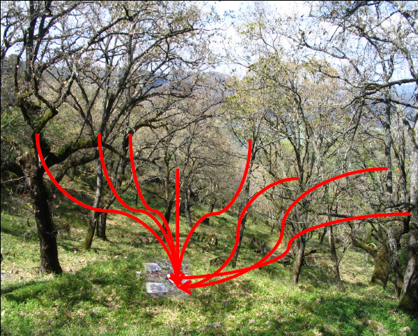

```{r include=FALSE, cache=FALSE}

library(rmarkdown)
library(knitr)

### Chunk options ###

## Text results
opts_chunk$set(echo = TRUE, warning = FALSE, message = FALSE)

## Code decoration
opts_chunk$set(tidy = FALSE, comment = NA, highlight = TRUE)

# ## Cache
opts_chunk$set(cache = 2, cache.path = "knitr_output/cache/")

# ## Plots
opts_chunk$set(fig.path = "knitr_output/figures/", fig.align = 'center')


```


## To answer questions like...

- what's the probability that something occurs?

- does X influence Y? How much? 

- can we predict Y knowing X, Z... How well?


## To ensure correct inferences

 


## To get answers to tough problems

For example...


----


## Inferring tree fecundity




## Course goals

- **Understand** statistical inference

- Avoid **misconceptions**

- Promote **good practices**


----

> **The purpose of models is not to fit data but to sharpen thinking**

Sam Karlin


## Topics

- Descriptive statistics

- Graphics

- Sampling

- Experimental design

- Hypothesis testing

- Bayesian inference

- Linear models & GLMs

- Model selection


