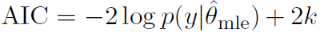

```{r include=FALSE, cache=FALSE}

library(rmarkdown)
library(knitr)

### Chunk options ###

## Text results
opts_chunk$set(echo = TRUE, warning = FALSE, message = FALSE)

## Code decoration
opts_chunk$set(tidy = FALSE, comment = NA, highlight = TRUE)

# ## Cache
opts_chunk$set(cache = 2, cache.path = "knitr_output/cache/")

# ## Plots
opts_chunk$set(fig.path = "knitr_output/figures/", fig.align = 'center')


```


## Why model selection?

- *Nested models*: how much complexity is necessary to fit the data?

- *Non-nested models*: compare fit of different models (e.g. alternative hypotheses)

    - But building larger model might be better than choosing any of them!


## Overfitting and balanced model complexity

\begincols

\begincol

```{r simuldata, echo=FALSE}
x <- seq(1:10)
y <- rnorm(10, 2 + 0.2*x, 0.3)
```


```{r linreg, echo=FALSE, fig.height=4, fig.width=4, eval = FALSE}
m1 <- lm(y~x)
plot(x,y, las=1, pch=19, main="Simple linear regression")
abline(m1, lwd=2, col="red")
```

```{r overfitted, echo=FALSE, warning=FALSE, message=FALSE, fig.cap="Overfitted model", fig.height=4, fig.width=4}
require(gam)
require(visreg)
m2 <- gam(y~s(x, df=10))
visreg(m2, line.par=list(col="red", lwd=2))
points(x,y, pch=19)
title("Overfit model")
```

\endcol


\begincol

```{r wrongmodel, echo=FALSE, fig.cap="Wrong model", fig.height=4, fig.width=4}
y2 <- rnorm(10, 2 + 0.8*x - 0.08*x^2, 0.3)
m3 <- lm(y2~x)
plot(x, y2, las=1, pch=19, main="Underfit/wrong model")
abline(m3, col="red", lwd=2)
```

\endcol

\endcols


## Overfitting: an example with niche modelling


Wenger & Olden (2012) [Assessing transferability of ecological models: an underappreciated aspect of statistical validation](http://dx.doi.org/10.1111/j.2041-210X.2011.00170.x). _Methods Ecol Evol_. 


\begincols

\begincol

GLMM 


\endcol

\begincol

Random forests (overfit) 


\endcol

\endcols


## So, two important aspects of model selection


- On one hand, we want to maximise fit.

- On the other hand, we want to avoid overfitting and overly complex models.


## Evaluating models' predictive accuracy


* Cross-validation (k fold, leave one out...)

- Alternatives:
    * AIC
    * BIC
    * DIC
    * WAIC...

- All these attempt an impossible task: 
      * estimating out-of-sample prediction error without external data or further model fits!

- All these methods have flaws!


## AIC



* First term: model fit (deviance, log likelihood)

* k: number of estimated parameters (penalisation for model complexity)

* AIC biased towards complex models.

* AICc recommended with 'small' sample sizes (n/p < 40). But see [Richards 2005 Ecology](http://www.esajournals.org/doi/pdf/10.1890/05-0074).

* Doesn't work with hierarchical models or informative priors!


## Problems of IC

* No information criteria is panacea: all have problems.

* They give average out-of-sample prediction error, but prediction errors can differ substantially within the same dataset (e.g. populations, species).

* Sometimes better models rank poorly (Gelman et al. 2013). So, combine with thorough model checks.


# So which variables should enter my model?


## Choosing predictors

* Choose variables based on **ecological understanding**, rather than throwing plenty of them in a fishing expedition.

* Propose single global model or small set (< 10 - 20) of **reasonable** candidate models.

* Number of variables balanced with sample size (at least 10 - 30 obs per param)

* Assess collinearity between predictors (Dormann et al 2013)
    * pairs() or similar
    * If |r| > 0.5 - 0.7, consider leaving one variable out, but keep it in mind when interpreting model results.
    * Or combine 2 or more in a synthetic variable (e.g. water deficit ~ Temp + Precip).
    * Many methods available, e.g. sequential, ridge regression... (see Dormann et al)
    * Measurement error can seriously complicate things (Biggs et al 2009; Freckleton 2011)
    
* For predictors with large effects, consider interactions.
    
* See also Zuur et al 2010.


## Think about the shape of relationships

y ~ x + z

Really? Not everything has to be linear! Actually, it often is not.

**Think** about shape of relationship. See chapter 3 in Bolker's book.


\begincols

\begincol

```{r echo=FALSE}
curve(0.7 + 0.3*x, ylab="y", las=1)
```

\endcol

\begincol

```{r echo=FALSE}
curve(0.7*x^0.3, ylab="y", las=1)
```

\endcol

\endcols


# Removing predictors


## Do not use stepwise regression

* Whittingham et al. (2006) Why do we still use stepwise modelling in ecology and behaviour? J. Animal Ecology.

* Mundry & Nunn (2009) Stepwise Model Fitting and Statistical Inference: Turning Noise into Signal Pollution. Am Nat.

* This includes stepAIC (e.g. Dahlgren 2010; Burnham et al 2011; Hegyi & Garamszegi 2011).


## Gelman's criteria for removing predictors

(assuming only potentially relevant predictors have been selected a priori)


* NOT significant + expected sign = let it be.

* NOT significant + NOT expected sign = remove it.

* Significant + NOT expected sign = check… confounding variables?

* Significant + expected sign = keep it!


## The modelling process


Bolker 2008


## Summary

1. Choose meaningful variables
    + Beware collinearity
    + Keep good n/p ratio

2. Generate global model or (small) set of candidate models
    + Avoid stepwise and all-subsets
    + Don't assume linear effects: think about appropriate functional relationships
    + Consider interactions for strong main effects
  
3. If > 1 model have similar support, consider model averaging (or blending).

4. Always check thoroughly fitted models
    + Residuals, goodness of fit...
    + Plot. Check models. Plot. Check assumptions. Plot. (Lavine 2014).
  
5. Always report effect sizes


