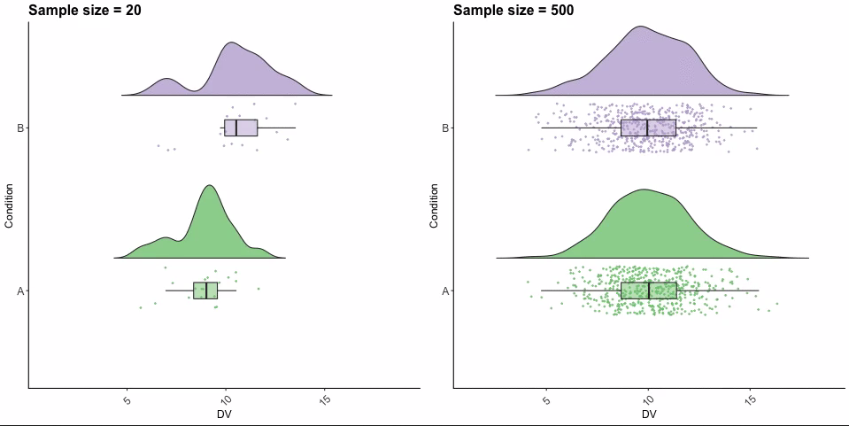
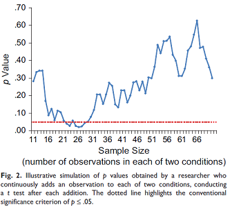

```{r include=FALSE, cache=FALSE}

library("knitr")

### Chunk options ###

## Text results
opts_chunk$set(echo = FALSE, warning = FALSE, message = FALSE, size = 'tiny')

## Code decoration
opts_chunk$set(tidy = FALSE, comment = NA, highlight = TRUE, prompt = FALSE, crop = TRUE)

# ## Cache
# opts_chunk$set(cache = TRUE, cache.path = "knitr_output/cache/")

# ## Plots
# opts_chunk$set(fig.path = "knitr_output/figures/")
opts_chunk$set(fig.align = 'center', out.width = '90%')

### Hooks ###
## Crop plot margins
knit_hooks$set(crop = hook_pdfcrop)

## Reduce font size
## use tinycode = TRUE as chunk option to reduce code font size
# see http://stackoverflow.com/a/39961605
knit_hooks$set(tinycode = function(before, options, envir) {
  if (before) return(paste0("\n \\", options$size, "\n\n"))
  else return("\n\n \\normalsize \n")
  })

```

---

\LARGE

*The most important aspect of a statistical analysis is not what you do with the data, it’s what data you use*

\vspace{1cm}

\tiny [H. Stern / A. Gelman](https://statmodeling.stat.columbia.edu/2018/08/07/important-aspect-statistical-analysis-not-data-data-use-survey-adjustment-edition)


## The importance of sample size

- Many studies have **too low sample sizes**. 

- Low sample sizes **miss subtle effects**, but also **prone to bias**.

- The **fallacy** of assuming that which does not kill statistical significance makes it stronger ([Loken & Gelman 2017](http://science.sciencemag.org/content/355/6325/584.summary)).


## Low sample sizes are very sensitive to random noise

[](https://video.twimg.com/tweet_video/DifncYiX0AEnn19.mp4)

\tiny https://twitter.com/ajstewart_lang/status/1020038488278945797


## Low sample sizes may bias inferences about population


\tiny Source: statisticalgate.com

<!-- \tiny http://statisticalgate.com/regression-simulation/ -->


## Low sample sizes may bias inferences

See [*The evolution of correlations*](http://vimeo.com/57127001)

**Stopping rules**

```{r echo=FALSE, out.height='2.5in', out.width='2.5in'}

```


## Sample size estimation

- **Plan** model/statistical analysis **before** data collection.

- **Do simulations**. Power/Sample size/Precision analyses (e.g. see papers like [this](https://doi.org/10.1136/bmj.m441) & [this](https://doi.org/10.1111/2041-210X.12504), or software like [this](https://cran.r-project.org/package=pmsampsize) & [this](https://precisely.malco.io/)).

- **Justify** your sample size (precision, minimal effect size...). See [Lakens' book](https://lakens.github.io/statistical_inferences/08-samplesizejustification.html).

- Plan to have at least **10-30 observations per predictor**.

- Complex models (w/ many predictors, interactions etc) require **high** sample sizes.


## Sample size estimation

\footnotesize

::: nonincremental :::
Calculating sample size for Gaussian (Normal) response model:

  - expected mean: 30
  - expected sd: 10
  - 10 parameters (predictors)
  - expected R-squared: 0.2
:::
  
\tiny

```{r echo = TRUE, tinycode = TRUE}
library(pmsampsize)
pmsampsize(type = "c", parameters = 10, intercept = 30, sd = 10, rsquared = 0.2)
```


## Sample size estimation

\footnotesize

::: nonincremental :::
Calculating sample size for binary response model:

  - expected prevalence: 0.1
  - 20 parameters (predictors)
  - expected R-squared: 0.2
:::

\tiny 

```{r echo = TRUE, tinycode = TRUE}
library(pmsampsize)
pmsampsize(type = "b", parameters = 20, prevalence = 0.1, nagrsquared = 0.2)
```


