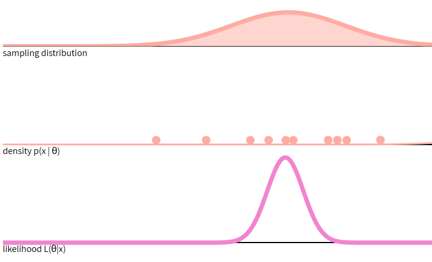

```{r include=FALSE, cache=FALSE}

library("knitr")

### Chunk options ###

## Text results
opts_chunk$set(echo = FALSE, warning = FALSE, message = FALSE, size = 'tiny')

## Code decoration
opts_chunk$set(tidy = FALSE, comment = NA, highlight = TRUE, prompt = FALSE, crop = TRUE)

# ## Cache
# opts_chunk$set(cache = TRUE, cache.path = "knitr_output/cache/")

# ## Plots
# opts_chunk$set(fig.path = "knitr_output/figures/")
opts_chunk$set(fig.align = 'center', out.width = '90%')

### Hooks ###
## Crop plot margins
knit_hooks$set(crop = hook_pdfcrop)

## Reduce font size
## use tinycode = TRUE as chunk option to reduce code font size
# see http://stackoverflow.com/a/39961605
knit_hooks$set(tinycode = function(before, options, envir) {
  if (before) return(paste0("\n \\", options$size, "\n\n"))
  else return("\n\n \\normalsize \n")
  })

```


## Inference: from samples to population

We rarely measure the whole **population**, but take **samples**.

Then we make inferences from sample to population.

```{r out.width='80%'}

```


## If we sample 30 trees in our neighbourhood...

::: nonincremental :::
Can we extrapolate results to 

  - whole neighbourhood?
  
  - whole city?
  
  - whole country?
  
  - the world?
  

What’s the **suitable population** to make inferences given this sample?

:::

::: hide :::
## What's the average height in this group?

1. Write down your height and place of origin (Sevilla or other) in a piece of paper and put it in the bag.

2. Now everyone **sample** 5 individuals from the whole **population** of heights.

3. Calculate the mean and 95% CI for your sample (http://graphpad.com/quickcalcs/CImean1/).

4. Draw on blackboard.

5. Do all CIs contain true mean height?

:::


## Understanding confidence intervals

- Summarise **uncertainty** in parameter estimates.

- https://rpsychologist.com/d3/CI/ (or [here](https://seeing-theory.brown.edu/frequentist-inference/index.html#section2))

- A 95% CI is **NOT** 95% likely to contain the true parameter value!

- Instead, 95% of the CIs obtained with this sampling will contain the true value. 

- Like person who tells truth 95% of the time, but we can't tell if a particular statement is true.

- It's a frequentist, long-run property.

- To read more: [Morey et al (2015)](https://learnbayes.org/papers/confidenceIntervalsFallacy/)


## What happens if we increase sample size?

https://rpsychologist.com/d3/CI/

- CI width *decreases*...

- but still 5% of CIs will NOT contain true mean!


## If the 95% CI of X is (120, 150)...


- There is a 95% probability that X lies between 120 and 150

- We can be 95% confident that X lies between 120 and 150

- If we repeated the experiment, 95% of the time X would fall between 120 and 150

- If we repeated the experiment, 95% of the CIs would contain the true value of X

- The probability that X is greater than 0 is at least 95%

- The probability that X equals 0 is smaller than 5%


https://pollev.com/franciscorod726


## Bayesian credible intervals

- Bayesian **credible** intervals do give the probability that true parameter value is contained within them.

- Frequentist CIs and Bayesian credible intervals can be similar, but not always.


## Bayesian inference: prior, posterior, and likelihood

$P(Unknown|Data) \propto P(Data|Unknown) \times P(Unknown)$

$Posterior \propto Likelihood \times Prior$

```{r echo = FALSE, results='hide'}

set.seed(28)
# example with tree diameters
diam.sd <- 30
diam <- rnorm(8, 100, diam.sd)

prior.diam <- 40
prior.diam.var <- 50

library(blmeco)
blmeco::triplot.normal.knownvariance(theta.data = mean(diam), 
                                     n = length(diam), 
                                     variance.known = diam.sd*diam.sd, 
                                     prior.theta = prior.diam, 
                                     prior.variance = prior.diam.var)
title("Tree diameter in your neighbourhood")
```


```{r echo = FALSE, results='hide', eval=FALSE}

# height <- runif(10, 170, 190)
# 
# prior.height <- 160
# prior.height.var <- 20

set.seed(123)
# example with students' hours of sleep
sleephours.sd <- 2
sleephours <- rnorm(8, 9, sleephours.sd)

prior.sleep <- 7
prior.sleep.var <- 1

library(blmeco)
blmeco::triplot.normal.knownvariance(theta.data = mean(sleephours), 
                                     n = length(sleephours), 
                                     variance.known = sleephours.sd*sleephours.sd, 
                                     prior.theta = prior.sleep, 
                                     prior.variance = prior.sleep.var)
title("How many hours of daily sleep?")
```

## What is the likelihood?

$L(\theta|x) = P(x|\theta)$

```{r echo=FALSE}

```

\tiny https://seeing-theory.brown.edu/bayesian-inference/index.html


## Bayesian inference: prior and likelihood produce posterior

```{r echo = FALSE, results='hide'}

set.seed(28)
# example with tree diameters
diam.sd <- 30
diam <- rnorm(8, 100, diam.sd)

prior.diam <- 40
prior.diam.var <- 50

library(blmeco)
blmeco::triplot.normal.knownvariance(theta.data = mean(diam), 
                                     n = length(diam), 
                                     variance.known = diam.sd*diam.sd, 
                                     prior.theta = prior.diam, 
                                     prior.variance = prior.diam.var)
title("Tree diameter in your neighbourhood (n = 8)")
```


## With increasing sample size, likelihood dominates prior

```{r echo = FALSE, results='hide'}

set.seed(28)
# example with tree diameters
diam.sd <- 30
diam <- rnorm(100, 100, diam.sd)

prior.diam <- 40
prior.diam.var <- 50

library(blmeco)
blmeco::triplot.normal.knownvariance(theta.data = mean(diam), 
                                     n = length(diam), 
                                     variance.known = diam.sd*diam.sd, 
                                     prior.theta = prior.diam, 
                                     prior.variance = prior.diam.var)
title("Tree diameter in your neighbourhood (n = 100)")
```


## More apps to introduce Bayesian inference

- [Wagenmaker's first lesson in Bayesian inference](https://shiny.psy.lmu.de/felix/BayesLessons/BayesianLesson1.Rmd)

- [Bayesian Demo](https://micl.shinyapps.io/prior2post/)

- [Bayesian inference for a population mean](https://patrickbarks.shinyapps.io/bayes/)

- [Normal](https://r.amherst.edu/apps/nhorton/Shiny-Bayes3/)

- [Binomial](https://r.amherst.edu/apps/nhorton/Shiny-Bayes2/)

- [Own data](https://utrecht-university.shinyapps.io/bayesian_estimation/)

- [Bayesian t-test](http://rpsychologist.com/d3/bayes/)


## Bayesian statistics in practice

- Integrate information (prior)

- Prior regularises unlikely estimates from data

- Large dataset -> prior effect diminishes

- Uncertainty / Propagate errors

