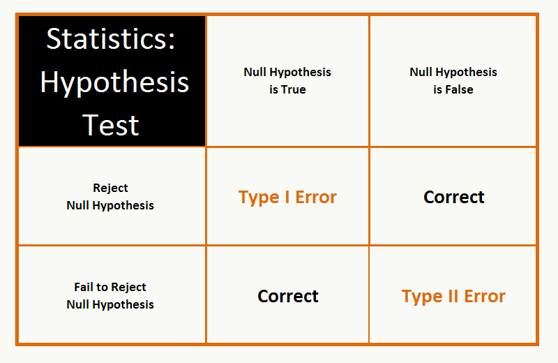
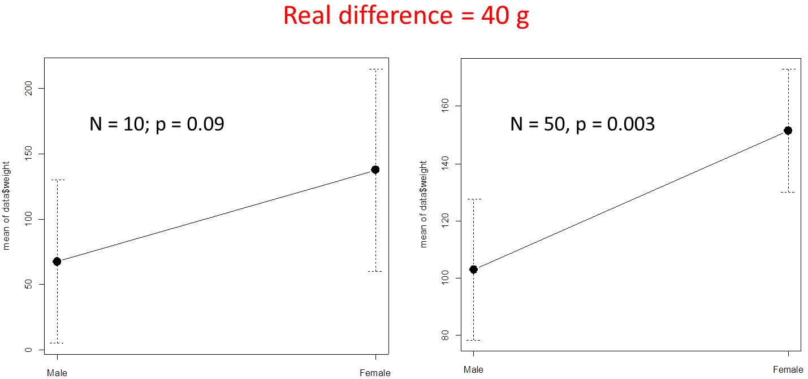
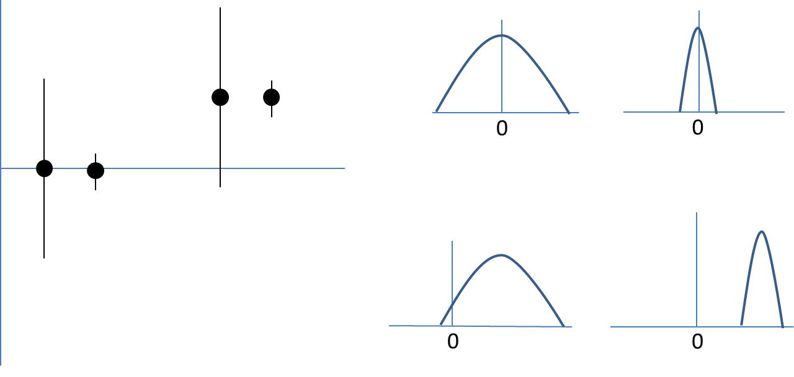

```{r knitr_setup, include=FALSE, cache=FALSE}

library(rmarkdown)
library(knitr)

### Chunk options ###

## Text results
opts_chunk$set(echo = TRUE, warning = FALSE, message = FALSE)

## Code decoration
opts_chunk$set(tidy = FALSE, comment = NA, highlight = TRUE)

# ## Cache
opts_chunk$set(cache = 2, cache.path = "knitr_output/cache/")

# ## Plots
opts_chunk$set(fig.path = "knitr_output/figures/", fig.align = 'center')


```


# Why statistics?


## To answer questions like...

- what's the probability that something occurs?

- does X influence Y? How much?


## To ensure correct inferences

 


## To get answers to tough problems

For example...


----


## Inferring tree fecundity


## Course goals

- **Understand** statistical inference

- Avoid **misconceptions**

- Promote **good practices**


## Topics

- Descriptive statistics

- Graphics

- Sampling

- Experimental design

- Hypothesis testing

- Bayesian inference

- Linear models & GLMs

- Model selection


# Descriptive statistics


# Guess my age

```{r echo = FALSE}
age <- runif(15, 30, 40)
```


## Graph your estimates

```{r}
hist(age)
```


## Summarise that distribution

\begincols

\begincol

- **Central tendency**

    - mean

    - median 

    - mode


- **Variation**

    - min, max, range

    - quantiles

    - standard deviation

    - standard error

    - coefficient of variation

    - confidence intervals

\endcol

\begincol

```{r echo = FALSE}
hist(age)
```

\endcol

\endcols


## In a Normal distribution


## What statistical descriptors are best? (and why)


```{r echo = FALSE}
par(mfrow = c(1,2))
data <- c(rnorm(30, 165, 5), 190, 200, 210, 210, 220, 220, 230)
hist(data)

data <- c(rep(0, 22), rep(1, 16))
hist(data)
par(mfrow = c(1,1))
```


# Sampling


## Inference: from samples to population

We rarely measure the whole **population**, but take **samples** instead.


## What's the average height in this class?

1. Write down your height and place of origin (Sevilla or other) in a piece of paper and put it in the bag.

2. Now everyone **sample** 5 individuals from the whole **population** of heights.

3. Calculate the mean and 95% CI for your sample (http://graphpad.com/quickcalcs/CImean1/).

4. Draw on blackboard.

5. Do all CIs contain true mean height?


## Understanding confidence intervals

- http://rpsychologist.com/d3/CI/

- A 95% CI is **NOT** 95% likely to contain the true parameter value!

- Instead, 95% of the CIs obtained with this sampling will contain the true value. 

- It's a frequentist, long-run property.

- To read more: [Morey et al (2015)](https://learnbayes.org/papers/confidenceIntervalsFallacy/)


## What happens if we increase sample size?

- CI width decreases...

- but still 5% of CIs will NOT contain true mean!


## Bayesian credible intervals

- Bayesian **credible** intervals do give the probability that true parameter value is contained within them.

- Frequentist CIs and Bayesian credible intervals can be similar, but not always.


## Bayesian inference: prior, posterior, and Bayes' theorem

$Posterior \propto Likelihood x Prior$

```{r echo = FALSE}

height <- runif(10, 160, 190)

prior.height <- 170
prior.height.var <- 20

library(blmeco)
blmeco::triplot.normal.knownvariance(theta.data = mean(height), n = length(height), 
                                     variance.known = 100, 
                                     prior.theta = prior.height, 
                                     prior.variance = prior.height.var)
```


# Experimental design


## Eg. Evaluating fertilizer effect


## Replication!


## Replication

- Determine sample size *a priori* according to wanted precision of estimates (power analysis).

- Traditionally, ecology studies have had too low sample sizes. 

- Hence missing many subtle effects, and prone to bias.

- Complex models (w/ interactions etc) require **high** sample sizes.


## Sample size is very important


See [The evolution of correlations](http://vimeo.com/57127001)

Stopping rules:


## Randomization


## Randomization

- Haphazard $\neq$ Random

- Stratify: randomize within groups (e.g. species, soil types)


## Have controls

- Untreated individuals, plots... (assigned randomly, of course).

- Must differ only in treatment (i.e. homogeneous environment).

- Measure before & after treatment.

- Consider blind designs to avoid observer bias.


# Hypothesis testing


## Does height differ between local and foreign students?

- Heigths in Sevilla:
```{r echo=FALSE}
h.sevi <- round(rnorm(5, 170, 10))
cat(h.sevi)
summary(h.sevi)
```


- Other heights:
```{r echo=FALSE}
h.out <- round(rnorm(10, 178, 10))
cat(h.out)
summary(h.out)
```


- We know what happens in **our samples**, but want to extrapolate to the whole **population**.


## If we sample students' heights in this class...

- Can we extrapolate results to

    - this class?

    - this university?

    - this city?

    - the world?

- What's the **suitable population** to make inferences given this sample?


# NHST concepts


## Null and alternative hypotheses

-

- **Null hypothesis**: heights don't differ. 

- **Alternative hypothesis**: heights are different.


## **P value**

- 

- Probability of observing data as or more extreme than these *if H0 was true*.

- Hence **the lower P the more unlikely H0** (i.e. more likely there's a true difference).


## Are differences *significant*?

- If p < 0.05, we **reject** H0.

- If p > 0.05, we **fail to reject** H0

- (which is not the same as 'H0 is true')


## Let's do the test

```{r echo = TRUE}
t.test(h.sevi, h.out)
```

**Are heights different then?**


## Rejecting hypotheses: two types of error


## Rejecting hypotheses: two types of error



 
**Power**: Probability of detecting true difference (rejecting H0 when it's false).


## Understanding NHST

http://rpsychologist.com/d3/NHST/


## Example: biased coin

```{r coin, echo = 4}
ntrials <- 10
coin <- rbinom(ntrials, 1, 0.6)
coin

test <- prop.test(sum(coin), ntrials)
test
```


## Correlation between variables

http://rpsychologist.com/d3/correlation/


# Common pitfalls and good practice


## Interesting reading


http://dx.doi.org/10.1890/ES13-00160.1


## First things first

- Always 

- Always 

- Always


## Plot data and models


----

> **Plot. Check models. Plot. Check assumptions. Plot.**

[Lavine 2014 *Ecology*](http://dx.doi.org/10.1890/13-1112.1)


## News: Hamburgers increase risk of heart attack

- In a sample of 10,000 people, it was found that eating >2 hamburgers a week increased heart attacks by 50%.

- **Do hamburgers increase heart attacks?**


## Bigger flowers increase reproductive success

- We found that plants with bigger flowers produced 30% more seeds...

- **Do big flowers increase reproductive success?**


## Correlation vs Causation


http://tylervigen.com/spurious-correlations


## Statistically significant != biologically important

- Big real difference but low sample size:




## Statistically significant != biologically important

- Trivial difference, big sample size:


## Statistically significant != biologically important

- P-value depends on sample size: with large `n`, everything can be significant.

- Suggested reading: [significantly misleading](http://www.statslife.org.uk/the-statistics-dictionary/1000-the-statistics-dictionary-significantly-misleading)


## Not significant != there is no effect




## Failure to reject H0 != H0 is true


## 0.05 is an arbitrary threshold


http://dx.doi.org/10.1198/000313006X152649


## Multiple hypothesis testing


## How to make your results significant

1. Test multiple variables, then report the ones that are significant.

2. Artificially choose when to end your experiment.

3. Add covariates until effects are significant.

4. Test different conditions (e.g. different levels of a factor) and report the ones you like.

- To read more: [Simmons et al 2011](http://papers.ssrn.com/sol3/papers.cfm?abstract_id=1850704)


## The New Statistics

Aim for estimation of effects and their uncertainty.


http://dx.doi.org/10.1177/0956797613504966


## How many types of errors?

- **Type I**: incorrect rejection of null hypothesis.

- **Type II**: failure to reject false null hypothesis.

- **Type S (Sign)**: estimating effect in opposite direction.

- **Type M (Magnitude)**: Misestimating magnitude of the effect (under or overestimating).

- **Type III**: [finding right answer to the wrong question!](http://dx.doi.org/10.1890/1540-9295-10.8.446)


# Introduction to statistical modelling


## Modern statistics are easier than this


## Our overarching regression framework 


$$
  \begin{aligned}  
  y_{i}=a+bx_{i}+\varepsilon _{i} \\  
  \varepsilon _{i}\sim N\left( 0,\sigma^2 \right) \\  
  \end{aligned}  
$$

\begincols

\begincol
```{r regplot, echo=FALSE, fig.align='left', fig.height=5, fig.width=4}
data(iris)
setosa <- iris[iris$Species == "setosa", ]
plot(setosa[,3], setosa[,4], xlab = "x", ylab = "y", ylim = c(-0.1, 0.65), 
     pch=19, las = 1, cex.lab = 1.5, xlim = c(0, 2))
abline(lm(setosa[,4] ~ setosa[,3]), lwd = 3)
```
\endcol

\begincol

**Data**  
*y* = response variable  
*x* = predictor 
    

**Parameters**  
*a* = intercept    
*b* = slope     
$\sigma$ = residual variation    
$\varepsilon$ = residuals  

\endcol
\endcols


## Residual variation (error) 

\begincols
\begincol
```{r small_residuals, echo=FALSE, fig.width=4}
set.seed(123)
x <- runif(50, 10, 30)
y <- rnorm(50, 4 + 0.3*x, 0.5)
plot(x, y, las = 1, main = "small")
abline(lm(y ~ x), lwd = 3)
```
\endcol

\begincol
```{r large_residuals, echo=FALSE, fig.width=4}
y2 <- rnorm(50, 4 + 0.3*x, 3)
plot(x, y2, las = 1, main = "large")
abline(lm(y2 ~ x), lwd = 3)
```
\endcol
\endcols


## Residual variation

$$
  \begin{aligned}  
  \varepsilon _{i}\sim N\left( 0,\sigma^2 \right) \\  
  \end{aligned}  
$$

```{r sigmas, echo=FALSE, fig.align='center'}
s1 <- density(rnorm(1000, 0, 2))
s2 <- density(rnorm(1000, 0, 5))
s3 <- density(rnorm(1000, 0, 10))
plot(s3, ylim=c(0,0.2), ylab="", xlab="", main="Distribution of residuals", lwd=2, col="red", yaxt="n")
lines(s2, lwd=2, col="blue")
lines(s1, lwd=2)
Hmisc::labcurve(list(s1, s2, s3), labels=paste("sigma = ", c(2,5,10), sep=""), type="l", col=c("black", "blue", "red"))
```


## In a Normal distribution


# Let's do real data analysis


## Q: What is the relationship between petal width and length in *Iris setosa*?

```{r echo=FALSE}
data(iris)
setosa <- subset(iris, Species == "setosa")
head(setosa)
```


## Always plot your data first!


## Outliers impact on regression


See http://rpsychologist.com/d3/correlation/


## Scatterplot

```{r scatterplot}
plot(setosa$Petal.Width, setosa$Petal.Length, las = 1)
```


## Now fit model

```{r lm_iris}
m1 <- lm(Petal.Length ~ Petal.Width, data = setosa)
```


## What does this mean? 

```{r summary_lm, echo=FALSE}
summary(m1)
```


## Plot model (visreg)

```{r echo = 2}
library(visreg)    
visreg(m1)
```


## Linear model assumptions

- Linearity (transformations, GAM...)
  
- Residuals:
    - Independent
    - Equal variance
    - Normal

- No measurement error in predictors


## Model checking: residuals

```{r plot_lm, echo=FALSE}
def.par <- par(no.readonly = TRUE)
layout(matrix(1:4, nrow=2))
plot(m1)
par(def.par)
```


## Are residuals normal? 


```{r resid_hist, echo=TRUE}
hist(resid(m1))
```


## How good is the model in predicting petal length?

Observed vs Predicted values: use `fitted`.

```{r obs_pred, fig.width=3, fig.height=3, echo=1}
plot(setosa$Petal.Length, fitted(m1), xlab = "Petal length - observed", ylab = "Petal length - predicted", las = 1, xlim = c(1,2), ylim = c(1,2))
abline(a = 0, b = 1)
```

Concordant with low R-squared!


## Using fitted model for prediction

Q: Expected petal length if width = 0.39?


## Using fitted model for prediction

Q: Expected petal length if width = 0.39?

```{r}
predict(m1, data.frame(Petal.Width = c(0.39)), se.fit = TRUE)
```


## Important functions

- `plot`

- `summary`

- `coef`

- `confint`

- `fitted`

- `resid`

- `predict`


# Categorical predictors (factors)


## Q: Does petal length vary among *Iris* species?

First, a plot:

```{r boxplot}
plot(Petal.Length ~ Species, data = iris)
```


## Linear model with categorical predictors

$$
  \begin{aligned} 
  y_{i}=a+bx_{i}+\varepsilon _{i} \\  
  y_{i}=a+b_{versicolor}+c_{virginica}+\varepsilon _{i} \\     
  \end{aligned} 
$$


## Model

```{r lm_categ, echo=1}
m2 <- lm(Petal.Length ~ Species, data = iris)
summary(m2)
```


## Petal length differences across 3 _Iris_ species

```{r iris_plot}
visreg(m2)
```


## Are differences statistically significant?

Compare CIs

```{r echo = 2}
library(effects)
summary(allEffects(m2))
```


## Plotting effects

```{r}
plot(allEffects(m2))
```


# Does height differ between local and foreign students?


# Combining continuous and categorical predictors


## Predicting *Iris* petal length according to species and petal width

$$
  \begin{aligned} 
  y_{i}=a+bx_{i}+\varepsilon _{i} \\  
  y_{i}=a+b_{versicolor}+c_{virginica}+\varepsilon _{i} \\   
  y_{i}=a+b_{versicolor}+c_{virginica}+ d \cdot PetalWidth_{i} + \varepsilon _{i} \\   
  \end{aligned} 
$$


## Predicting *Iris* petal length according to species and petal width


```{r echo = FALSE}
multreg <- lm(Petal.Length ~ Species + Petal.Width, data = iris)
summary(multreg)
```


# Generalised Linear Models (GLMs)


## Q: Survival of passengers on the Titanic ~ Class

Read `titanic_long.csv` dataset.

```{r prepare_titanic_data, echo=FALSE, eval=FALSE}
titanic <- read.table("http://www.amstat.org/publications/jse/datasets/titanic.dat.txt")
names(titanic) <- c("class", "age", "sex", "survived")
titanic$class <- factor(titanic$class, labels = c("crew", "first", "second", "third"))
titanic$age <- factor(titanic$age, labels = c("child", "adult"))
titanic$sex <- factor(titanic$sex, labels = c("female", "male"))
write.csv(titanic, file = "data-raw/titanic_long.csv", row.names=FALSE, quote=FALSE)
```

```{r read_titanic, echo=FALSE}
titanic <- read.csv("data-raw/titanic_long.csv")
head(titanic)
```


## Let's fit linear model:

```{r titanic_lm, echo=1}
m5 <- lm(survived ~ class, data = titanic)
layout(matrix(1:4, nrow=2))
plot(m5)
par(def.par)
```


## Weird residuals!

```{r titanic_lm_resid, echo=FALSE}
hist(resid(m5))
```


## What if your residuals are clearly non-normal?   |   And variance not constant (heteroscedasticity)?

* Binary variables (0/1)
* Counts (0, 1, 2, 3, ...)


## Generalised Linear Models

1. **Response variable** - distribution `family`
    + Bernouilli - Binomial
    + Poisson
    + Gamma
    + etc
  
2. **Predictors** (continuous or categorical)

3. **Link function**
    + Gaussian: identity
    + Binomial: logit, probit
    + Poisson: log...
    + See [`family`](http://www.rdocumentation.org/packages/stats/functions/family).


## The modelling process


Bolker 2008


## Bernouilli - Binomial distribution (Logistic regression) 

- Response variable: Yes/No (e.g. survival, sex, presence/absence)
- Link function: `logit` (others possible, see `family`).

$$
  \begin{aligned} 
  logit(p) = \ln \left( \dfrac {p} {1-p}\right) \\ 
  \end{aligned} 
$$

Then

$$
  \begin{aligned} 
  Pr(alive) = a + bx \\  
  logit(Pr(alive)) = a + bx \\  
  Pr(alive) = invlogit(a + bx) = \dfrac {e^{a+bx}} {1+e^{a+bx}} \\  
  \end{aligned} 
$$
  


## Back to survival of Titanic passengers 

How many passengers travelled in each class?


## Back to survival of Titanic passengers 

How many passengers travelled in each class?
```{r}
tapply(titanic$survived, titanic$class, length)
```


## Back to survival of Titanic passengers 

How many passengers travelled in each class?
```{r}
tapply(titanic$survived, titanic$class, length)
```

How many survived?


## Back to survival of Titanic passengers 

How many passengers travelled in each class?
```{r}
tapply(titanic$survived, titanic$class, length)
```

How many survived?
```{r}
tapply(titanic$survived, titanic$class, sum)
```


## Back to survival of Titanic passengers 

How many passengers travelled in each class?
```{r}
tapply(titanic$survived, titanic$class, length)
```

How many survived?
```{r}
tapply(titanic$survived, titanic$class, sum)
```

What proportion survived in each class?
```{r}
as.numeric(tapply(titanic$survived, titanic$class, mean))
```


## Back to survival of Titanic passengers (dplyr)

Passenger survival according to class
```{r titanic_dplyr}
library(dplyr)
titanic %>%
  group_by(class, survived) %>%
  summarise(count = n())
```

Or `summarise(group_by(titanic, class, survived), count = n())`


## Or graphically...

```{r titanic_eda}
plot(factor(survived) ~ class, data = titanic)
```


## Fitting GLMs in R: `glm`

```{r titanic_glm, echo=1}
tit.glm <- glm(survived ~ class, data=titanic, family=binomial)
summary(tit.glm)
```

These estimates are in logit scale!


## Interpreting logistic regression output 

Parameter estimates (logit-scale)
```{r tit_glm_coef, echo=FALSE}
coef(tit.glm)
```

**We need to back-transform**: apply *inverse logit*    
Crew probability of survival:
```{r tit_glm_invlogit}
plogis(coef(tit.glm)[1])
```

Looking at the data, the proportion of crew who survived is
```{r crew_surv, echo=FALSE}
sum(titanic$survived[titanic$class == "crew"]) / nrow(titanic[titanic$class == "crew", ])
```


## Q: Probability of survival for 1st class passengers? 

```{r first_surv}
plogis(coef(tit.glm)[1] + coef(tit.glm)[2])
```

Needs to add intercept (baseline) to the parameter estimate. Again this value matches the data: 
```{r first_surv_data}
sum(titanic$survived[titanic$class == "first"]) /   
  nrow(titanic[titanic$class == "first", ])
```


## Model interpretation using `effects` package

```{r tit_glm_effects}
library(effects)
allEffects(tit.glm)
```

## Effects plot

```{r effects_plot}
plot(allEffects(tit.glm))
```


## Logistic regression: model checking

```{r tit_glm_check, echo=FALSE}
layout(matrix(1:4, nrow=2))
plot(tit.glm)
par(def.par)
```

Not very useful.


## Binned residual plots for logistic regression

```{r binnedplot}
predvals <- predict(tit.glm, type="response")
arm::binnedplot(predvals, titanic$survived - predvals)
```


## Recapitulating

1. Import data: `read.table` or `read.csv`

2. Check data: `summary`

3. Plot data: `plot`

4. Fit model: `glm`. Don't forget to specify `family`!
  
5. Examine models: `summary`
  
6. Use `plogis` to apply back-transformation (*invlogit*) to parameter estimates (`coef`). Alternatively, use `allEffects` from `effects` package.

7. Plot model: `plot(allEffects(model))`. Or use `visreg`.

8. Examine residuals: `binnedplot` from package `arm`. Use `predict` to obtain predicted values for each obs.


# Q: Did men have higher survival than women?


## Plot first

```{r tit_sex_eda}
plot(factor(survived) ~ sex, data = titanic)
```

## Fit model

```{r tit_sex, echo=1}
tit.sex <- glm(survived ~ sex, data = titanic, family = binomial)
summary(tit.sex)
```


## Effects

\begincols
\begincol
```{r tit_sex_effects, echo=FALSE}
allEffects(tit.sex)
```
\endcol

\begincol
```{r tit_sex_effects2, echo=FALSE, fig.height=5, fig.width=4}
plot(allEffects(tit.sex))
```
\endcol
\endcols


# Q: Did women have higher survival because they travelled more in first class?


## Let's look at the data

`tapply`

```{r tit_women}
tapply(titanic$survived, list(titanic$class, titanic$sex), sum)
```

Mmmm...


## Fit model with both factors (interactions)

```{r tit_sex_class, echo=1}
tit.sex.class <- glm(survived ~ class * sex, data = titanic, family = binomial)
arm::display(tit.sex.class)
```


## Effects


\begincols
\begincol
```{r tit_sex_class_effects, echo=FALSE}
allEffects(tit.sex.class)
```
\endcol

\begincol
```{r tit_sex_class_effects2, echo=FALSE, fig.height=5, fig.width=4}
plot(allEffects(tit.sex.class))
```
\endcol
\endcols


So, women had higher probability of survival than men, even within the same class.


# Logistic regression for proportion data


## Read Titanic data in different format

Read `Titanic_prop.csv` data.

```{r read_tit_short, echo = FALSE}
tit.prop <- read.csv("data-raw/Titanic_prop.csv")
summary(tit.prop)
```

These are the same data, but summarized (see `Freq` variable).


## Use cbind(n.success, n.failures) as response

```{r binom_prop, echo=1}
prop.glm <- glm(cbind(Yes, No) ~ Class, data = tit.prop, family = binomial)
summary(prop.glm)
```

## Effects

```{r prop_glm_effects, echo=FALSE}
allEffects(prop.glm)
```

Compare with former model based on raw data:
```{r comp, echo=FALSE}
allEffects(tit.glm)
```

Same results!


# Logistic regression with continuous predictors


----

Example dataset: [GDP and infant mortality](http://vincentarelbundock.github.io/Rdatasets/doc/car/UN.html)

Read `UN_GDP_infantmortality.csv`.

```{r read_gdp, echo = FALSE}
gdp <- read.csv("http://vincentarelbundock.github.io/Rdatasets/csv/car/UN.csv")
names(gdp) <- c("country", "mortality", "gdp")
summary(gdp)
```


## EDA

```{r gdp_eda}
plot(mortality ~ gdp, data = gdp, main = "Infant mortality (per 1000 births)")
```


## Fit model

```{r gdp_glm, echo=1}
gdp.glm <- glm(cbind(mortality, 1000 - mortality) ~ gdp, 
               data = gdp, family = binomial)
summary(gdp.glm)
```


## Effects

```{r gdp_effects}
allEffects(gdp.glm)
```

## Effects plot

```{r gdp_effectsplot}
plot(allEffects(gdp.glm))
```


## Plot model and data

```{r logistic_plot}
plot(mortality/1000 ~ gdp, data = gdp, main = "Infant mortality rate")
curve(plogis(coef(gdp.glm)[1] + coef(gdp.glm)[2]*x), from = 0, to = 40000, add = TRUE, lwd=3, col="red")
```


## Or using visreg:

```{r gdp_visreg}
visreg(gdp.glm, scale = "response")
points(mortality/1000 ~ gdp, data = gdp)
```


# Overdispersion


## Overdispersion in logistic regression with proportion data

```{r logreg_overdisp, echo=1}
gdp.overdisp <- glm(cbind(mortality, 1000 - mortality) ~ gdp, 
               data = gdp, family = quasibinomial)
summary(gdp.overdisp)
```


## Mean estimates do not change after accounting for overdispersion

```{r logreg_overdisp2, echo=FALSE}
allEffects(gdp.overdisp)
allEffects(gdp.glm)
```


## But standard errors (uncertainty) do!

\begincols
\begincol
```{r overdisp_eff1, echo=FALSE, fig.height=5, fig.width=4}
plot(allEffects(gdp.overdisp))
```
\endcol

\begincol
```{r overdisp_eff2, echo=FALSE, fig.height=5, fig.width=4}
plot(allEffects(gdp.glm))
```
\endcol
\endcols


## Plot model and data

\begincols
\begincol
```{r overdisp_plot1, echo=FALSE, fig.height=5, fig.width=4}
library(arm)
plot(mortality/1000 ~ gdp, data = gdp, main = "Binomial", pch=20)
curve(plogis(coef(gdp.glm)[1] + coef(gdp.glm)[2]*x), from = 0, to = 40000, add = TRUE, lwd=3, col="red")
curve(plogis(coef(gdp.glm)[1] - 2*se.coef(gdp.glm)[1] +
               (coef(gdp.glm)[2] - 2*se.coef(gdp.glm)[2])*x), from = 0, to = 40000, add = TRUE, lwd=3, col="blue", lty=2)
curve(plogis(coef(gdp.glm)[1] + 2*se.coef(gdp.glm)[1] +
               (coef(gdp.glm)[2] + 2*se.coef(gdp.glm)[2])*x), from = 0, to = 40000, add = TRUE, lwd=3, col="blue", lty=2)
```
\endcol

\begincol
```{r overdisp_plot2, echo=FALSE, fig.height=5, fig.width=4}
plot(mortality/1000 ~ gdp, data = gdp, main = "Quasibinomial", pch=20)
curve(plogis(coef(gdp.overdisp)[1] + coef(gdp.overdisp)[2]*x), from = 0, to = 40000, add = TRUE, lwd=3, col="red")
curve(plogis(coef(gdp.overdisp)[1] - 2*se.coef(gdp.overdisp)[1] +
               (coef(gdp.overdisp)[2] - 2*se.coef(gdp.overdisp)[2])*x), from = 0, to = 40000, add = TRUE, lwd=3, col="blue", lty=2)
curve(plogis(coef(gdp.overdisp)[1] + 2*se.coef(gdp.overdisp)[1] +
               (coef(gdp.overdisp)[2] + 2*se.coef(gdp.overdisp)[2])*x), from = 0, to = 40000, add = TRUE, lwd=3, col="blue", lty=2)
```
\endcol
\endcols


## Overdispersion

Whenever you fit logistic regression to **proportion** data, check family `quasibinomial`.


## Think about the shape of relationships

y ~ x + z

Really? Not everything has to be linear! Actually, it often is not.

**Think** about shape of relationship. See chapter 3 in Bolker's book.


\begincols

\begincol

```{r echo=FALSE}
curve(0.7 + 0.3*x, ylab="y", las=1)
```

\endcol

\begincol

```{r echo=FALSE}
curve(0.7*x^0.3, ylab="y", las=1)
```

\endcol

\endcols


# GLMs for count data: Poisson regression


## Types of response variable

- Gaussian: `lm`

- Bernouilli / Binomial: `glm` (family `binomial / quasibinomial`)

- Counts: `glm` (family `poisson / quasipoisson`)


## Poisson regression

- Response variable: Counts (0, 1, 2, 3...) - discrete

- Link function: `log`

Then

$$
  \begin{aligned} 
  log(N) = a + bx \\  
  N = e^{a+bx} \\ 
  \end{aligned} 
$$


## Example dataset: Seedling counts in 0.5 m2 quadrats


```{r seedl_load, echo=1}
seedl <- read.csv("data-raw/seedlings.csv")
summary(seedl)
```


## EDA

```{r poisson_eda, fig.height=2, fig.width=2}
table(seedl$count)
hist(seedl$count)
```


## Q: Relationship between Nseedlings and light?

```{r poisson_eda2}
plot(seedl$light, seedl$count, las = 1, xlab = "Light (GSF)", ylab = "Seedlings")
```


## Let's fit model (Poisson regression)

```{r poisson_glm}
seedl.glm <- glm(count ~ light, data = seedl, family = poisson)
summary(seedl.glm)
```


## Interpreting Poisson regression output {.build}

Parameter estimates (log scale):
```{r poisson_params}
coef(seedl.glm)
```

**We need to back-transform**: apply the inverse of the logarithm

```{r}
exp(coef(seedl.glm))
```


## So what's the relationship between Nseedlings and light?

```{r poisson_effects, echo=2}
#allEffects(seedl.glm)
plot(allEffects(seedl.glm))
```


## Using visreg

```{r poisson_visreg}
visreg(seedl.glm, scale = "response")
```


## Poisson regression: model checking

```{r poisson_check, echo=FALSE}
layout(matrix(1:4, nrow=2))
plot(seedl.glm)
par(def.par)
```

## Is there pattern of residuals along predictor?

```{r poisson_check2}
plot(seedl$light, resid(seedl.glm))
```


# Poisson regression: Overdispersion


## Always check overdispersion with count data

Use family `quasipoisson`

```{r poisson_overdisp, echo=FALSE}
seedl.overdisp <- glm(count ~ light, data = seedl, family = quasipoisson)
summary(seedl.overdisp)
```


## Mean estimates do not change after accounting for overdispersion

```{r poisson_overdisp2, echo=FALSE}
allEffects(seedl.overdisp)
allEffects(seedl.glm)
```


## But standard errors may change

\begincols
\begincol
```{r pois_overdisp_eff1, echo=FALSE, fig.height=5, fig.width=4}
plot(allEffects(seedl.overdisp))
```
\endcol

\begincol
```{r pois_overdisp_eff2, echo=FALSE, fig.height=5, fig.width=4}
plot(allEffects(seedl.glm))
```
\endcol
\endcols


# Mixed / Multilevel Models


## Mixed models enable us to account for variability

- Varying intercepts

- Varying slopes


## Single vs varying intercept

Dataset: 1000 trees from 10 plots (trees per plot: 4 - 392).

\begincols
\begincol
```{r single_interc, echo=FALSE, fig.height=5, fig.width=4}
trees <- read.table("data-raw/trees.txt", header=TRUE)
plot(height ~ dbh, data=trees, las=1, xlab="DBH (cm)", ylab="Height (m)", ylim = c(0, 50), 
     main = "Pooling all plots")
abline(lm(height ~ dbh, data=trees), lwd=4, col="red")
```
\endcol

\begincol
```{r varying_interc, echo=FALSE, fig.height=5, fig.width=4}
lm2 <- lm(height ~ factor(plot) + dbh, data = trees)
plot(trees$dbh[trees$plot==1], trees$height[trees$plot==1], 
     pch=20, las=1, xlab="DBH (cm)", ylab="Height (m)", col=1,
     ylim=c(0,50), main = "Different intercept for each plot")
abline(a=coef(lm2)[1], b=coef(lm2)[11], col=1, lwd=2)
for(i in 2:10){
  points(trees$dbh[trees$plot==i], trees$height[trees$plot==i], pch=20, col=i)
  abline(a=coef(lm2)[1] + coef(lm2)[i], b=coef(lm2)[11], col=i, lwd=2)
}
```
\endcol
\endcols


## Fitting a varying intercepts model with `lm`


```{r lm_varying, echo=FALSE}
lm.interc <- lm(height ~ factor(plot) + dbh, data = trees)
arm::display(lm.interc)
```


## Mixed model with varying intercepts

$$
  \begin{aligned}  
  y_{i}=a_{j}+bx_{i}+\varepsilon _{i} \\  
  a_{j} \sim N\left( 0,\tau^2 \right) \\  
  \varepsilon _{i}\sim N\left( 0,\sigma^2 \right) \\  
  \end{aligned}  
$$

En nuestro ejemplo:

$$
  \begin{aligned}  
  Height_{i}=plot_{j}+bDBH_{i}+\varepsilon _{i} \\  
  plot_{j} \sim N\left( 0,\tau^2 \right) \\  
  \varepsilon _{i}\sim N\left( 0,\sigma^2 \right) \\  
  \end{aligned}  
$$


## Fitting mixed/multilevel models


```{r mixed, echo=1:2}
library(lme4)
mixed <- lmer(height ~ dbh + (1|plot), data = trees)
summary(mixed)
```

## Retrieve model coefficients

```{r mixed_coefs}
coef(mixed)
```


## Visualising model: `allEffects`

\begincols
\begincol
```{r mixed_vis1, echo=FALSE}
allEffects(mixed)
```
\endcol

\begincol
```{r mixed_vis2, echo=FALSE, fig.height=5, fig.width=4}
plot(allEffects(mixed))
```
\endcol
\endcols


## Visualising model: `visreg`


```{r mixed_vis3, echo=FALSE, fig.height=3, fig.width=2.5}
visreg(mixed)
```


## Plotting regression for individual forest plots

```{r mixed_plot}
nplot <- 2
plot(trees$dbh[trees$plot==nplot], trees$height[trees$plot==nplot])
abline(a=coef(mixed)$plot[nplot, 1], b=coef(mixed)$plot[nplot, 2], lwd=2)
```


## Checking residuals

```{r mixed_resid}
plot(mixed)
```


# Multilevel logistic regression


## Q: Relationship between tree size and mortality

```{r}
plot(dead ~ dbh, data = trees)
```


## Q: Relationship between tree size and mortality

```{r}
plot(factor(dead) ~ dbh, data = trees)
```

## Fit simple logistic regression

```{r, echo=1}
simple.logis <- glm(dead ~ dbh, data = trees, family=binomial)
summary(simple.logis)
```


## Fit simple logistic regression (with plots)

```{r, echo=1}
logis2 <- glm(dead ~ dbh + factor(plot), data = trees, family=binomial)
summary(logis2)
```


## Fit multilevel logistic regression

```{r mixed_logis, echo=1}
mixed.logis <- glmer(dead ~ dbh + (1|plot), data=trees, family = binomial)
summary(mixed.logis)
```


## Retrieve model coefficients

```{r mixedlogis_coefs}
coef(mixed.logis)
```


## Visualising model: `allEffects`

\begincols
\begincol
```{r mixedlogis_vis1, echo=FALSE}
allEffects(mixed.logis)
```
\endcol

\begincol
```{r mixedlogis_vis2, echo=FALSE, fig.height=5, fig.width=4}
plot(allEffects(mixed.logis))
```
\endcol
\endcols


# MODEL SELECTION


## Why model selection?

- *Nested models*: how much complexity is necessary to fit the data?

- *Non-nested models*: compare fit of different models (e.g. alternative hypotheses)

    - But building larger model might be better than choosing any of them!


## Overfitting and balanced model complexity

\begincols

\begincol

```{r simuldata, echo=FALSE}
x <- seq(1:10)
y <- rnorm(10, 2 + 0.2*x, 0.3)
```


```{r linreg, echo=FALSE, fig.height=4, fig.width=4, eval = FALSE}
m1 <- lm(y~x)
plot(x,y, las=1, pch=19, main="Simple linear regression")
abline(m1, lwd=2, col="red")
```

```{r overfitted, echo=FALSE, warning=FALSE, message=FALSE, fig.cap="Overfitted model", fig.height=4, fig.width=4}
require(gam)
require(visreg)
m2 <- gam(y~s(x, df=10))
visreg(m2, line.par=list(col="red", lwd=2))
points(x,y, pch=19)
title("Overfit model")
```

\endcol


\begincol

```{r wrongmodel, echo=FALSE, fig.cap="Wrong model", fig.height=4, fig.width=4}
y2 <- rnorm(10, 2 + 0.8*x - 0.08*x^2, 0.3)
m3 <- lm(y2~x)
plot(x, y2, las=1, pch=19, main="Underfit/wrong model")
abline(m3, col="red", lwd=2)
```

\endcol

\endcols


## Overfitting: an example with niche modelling


Wenger & Olden (2012) [Assessing transferability of ecological models: an underappreciated aspect of statistical validation](http://dx.doi.org/10.1111/j.2041-210X.2011.00170.x). _Methods Ecol Evol_. 


\begincols

\begincol

GLMM 


\endcol

\begincol

Random forests (overfit) 


\endcol

\endcols


## So, two important aspects of model selection


- On one hand, we want to maximise fit.

- On the other hand, we want to avoid overfitting and overly complex models.


## Evaluating models' predictive accuracy


* Cross-validation (k fold, leave one out...)

- Alternatives:
    * AIC
    * BIC
    * DIC
    * WAIC...

- All these attempt an impossible task: 
      * estimating out-of-sample prediction error without external data or further model fits!

- All these methods have flaws!


## AIC


* First term: model fit (deviance, log likelihood)

* k: number of estimated parameters (penalisation for model complexity)

* AIC biased towards complex models.

* AICc recommended with 'small' sample sizes (n/p < 40). But see [Richards 2005 Ecology](http://www.esajournals.org/doi/pdf/10.1890/05-0074).

* Doesn't work with hierarchical models or informative priors!


## Problems of IC

* No information criteria is panacea: all have problems.

* They give average out-of-sample prediction error, but prediction errors can differ substantially within the same dataset (e.g. populations, species).

* Sometimes better models rank poorly (Gelman et al. 2013). So, combine with thorough model checks.


# So which variables should enter my model?


## Choosing predictors

* Choose variables based on **ecological understanding**, rather than throwing plenty of them in a fishing expedition.

* Propose single global model or small set (< 10 - 20) of **reasonable** candidate models.

* Number of variables balanced with sample size (at least 10 - 30 obs per param)

* Assess collinearity between predictors (Dormann et al 2013)
    * pairs() or similar
    * If |r| > 0.5 - 0.7, consider leaving one variable out, but keep it in mind when interpreting model results.
    * Or combine 2 or more in a synthetic variable (e.g. water deficit ~ Temp + Precip).
    * Many methods available, e.g. sequential, ridge regression... (see Dormann et al)
    * Measurement error can seriously complicate things (Biggs et al 2009; Freckleton 2011)
    
* For predictors with large effects, consider interactions.
    
* See also Zuur et al 2010.


# Removing predictors


## Do not use stepwise regression

* Whittingham et al. (2006) Why do we still use stepwise modelling in ecology and behaviour? J. Animal Ecology.

* Mundry & Nunn (2009) Stepwise Model Fitting and Statistical Inference: Turning Noise into Signal Pollution. Am Nat.

* This includes stepAIC (e.g. Dahlgren 2010; Burnham et al 2011; Hegyi & Garamszegi 2011).


## Gelman's criteria for removing predictors

(assuming only potentially relevant predictors have been selected a priori)


* NOT significant + expected sign = let it be.

* NOT significant + NOT expected sign = remove it.

* Significant + NOT expected sign = check… confounding variables?

* Significant + expected sign = keep it!


## Summary

1. Choose meaningful variables
    + Beware collinearity
    + Keep good n/p ratio

2. Generate global model or (small) set of candidate models
    + Avoid stepwise and all-subsets
    + Don't assume linear effects: think about appropriate functional relationships
    + Consider interactions for strong main effects
  
3. If > 1 model have similar support, consider model averaging (or blending).

4. Always check thoroughly fitted models
    + Residuals, goodness of fit...
    + Plot. Check models. Plot. Check assumptions. Plot. (Lavine 2014).
  
5. Always report effect sizes


## END


**:)**
     
Source code and materials: https://github.com/Pakillo/stats-intro    
    
  
    


