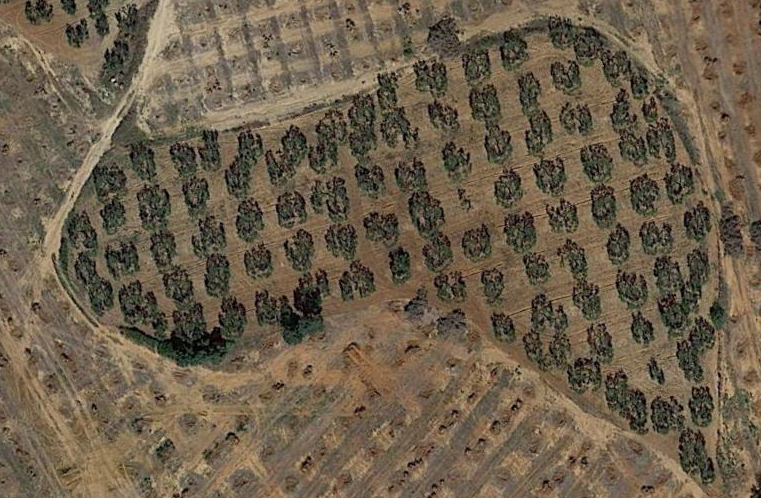
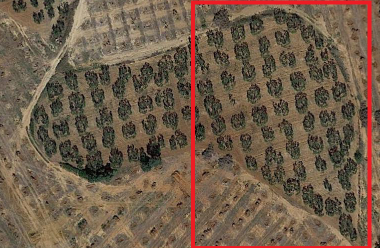
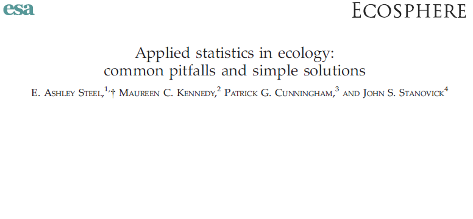
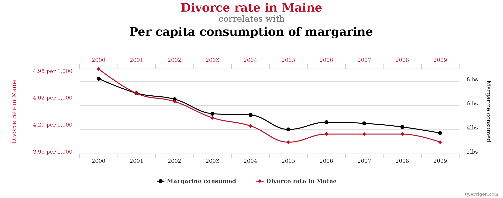
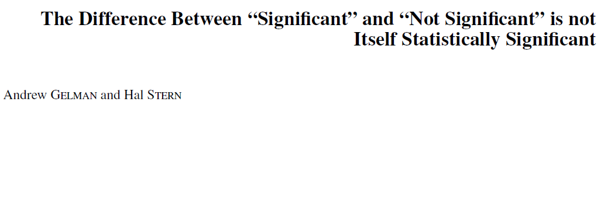
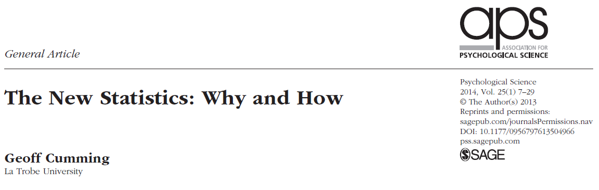

```{r knitr_setup, include=FALSE, cache=FALSE}

library(rmarkdown)
library(knitr)

### Chunk options ###

## Text results
opts_chunk$set(echo = TRUE, warning = FALSE, message = FALSE)

## Code decoration
opts_chunk$set(tidy = TRUE, comment = NA, highlight = TRUE)

# ## Cache
opts_chunk$set(cache = 2, cache.path = "knitr_output/cache/")

# ## Plots
opts_chunk$set(fig.path = "knitr_output/figures/", fig.align = 'center')


```


# Why statistics?


## To answer questions like...

- what's the probability that something occurs?

- does X influence Y? How much?


## To ensure correct inferences

 


## To get answers to tough problems

For example...


----


## Inferring tree fecundity


## Course goals

- **Understand** statistical inference

- Avoid **misconceptions**

- Promote **good practices**


## Topics

- Descriptive statistics

- Graphics

- Sampling

- Experimental design

- Hypothesis testing

- Bayesian inference

- Linear models & GLMs

- Model selection


# Descriptive statistics


# Guess my age

```{r echo = FALSE}
age <- runif(15, 30, 40)
```


## Graph your estimates

```{r}
hist(age)
```


## Summarise that distribution

\begincols

\begincol

- **Central tendency**

    - mean

    - median 

    - mode


- **Variation**

    - min, max, range

    - quantiles

    - standard deviation

    - standard error

    - coefficient of variation

    - confidence intervals

\endcol

\begincol

```{r echo = FALSE}
hist(age)
```

\endcol

\endcols


## In a Normal distribution


$\overline {x} \pm SD$ enclose **68%** of the data

$\overline {x} \pm 2SD$ enclose **95%** of the data

$\overline {x} \pm 3SD$ enclose **99%** of the data


## What statistical descriptors are best? (and why)


```{r echo = FALSE}
par(mfrow = c(1,2))
data <- c(rnorm(30, 165, 5), 190, 200, 210, 210, 220, 220, 230)
hist(data)

data <- c(rep(0, 22), rep(1, 16))
hist(data)
par(mfrow = c(1,1))
```


# Sampling


## Inference: from samples to population

We rarely measure the whole population, but take samples instead.




## What's the average height in this class?

1. Write down your height in a piece of paper and put it in the bag.

2. Now everyone **sample** 5 individuals from the whole **population** of heights.

3. Calculate the mean and 95% CI (http://graphpad.com/quickcalcs/CImean1/).

4. Draw on blackboard.

5. Do all CIs contain true mean height?


## Understanding confidence intervals

- http://rpsychologist.com/d3/CI/

- A 95% CI is **NOT** 95% likely to contain the true parameter value!

- Instead, 95% of the CIs obtained with this sampling will contain the true value. 

- It's a frequentist, long-run property.

- To read more: [Morey et al (2015)](https://learnbayes.org/papers/confidenceIntervalsFallacy/)


## What happens if we increase sample size?

- CI width decreases...

- but still 5% of CIs will NOT contain true mean!


## Bayesian credible intervals

- Bayesian **credible** intervals do give the probability that true parameter value is contained within them.

- Frequentist CIs and Bayesian credible intervals can be similar, but not always.


## Bayesian inference: prior, posterior, and Bayes' theorem

$Posterior \propto Likelihood x Prior$

```{r echo = FALSE}

height <- runif(10, 160, 190)

prior.height <- 170
prior.height.var <- 20

library(blmeco)
blmeco::triplot.normal.knownvariance(theta.data = mean(height), n = length(height), 
                                     variance.known = 100, 
                                     prior.theta = prior.height, 
                                     prior.variance = prior.height.var)
```


# Experimental design


## Randomization

Evaluating fertilizer effect




## Randomization

- Haphazard $\neq$ Random

- Stratify: randomize within groups


## Replication


## Replication

- Determine sample size *a priori* according to wanted precision of estimates (power analysis).

- Traditionally, ecology studies have had too low sample sizes. 

- Hence missing many subtle effects, and prone to bias.

- Complex models (w/ interactions etc) require **high** sample sizes.


## Sample size is very important


See [The evolution of correlations](http://vimeo.com/57127001)

Stopping rules:


## Have controls

- Untreated individuals, plots (assigned randomly, of course).

- Must differ only in treatment (i.e. homogeneous environment).

- Measure before & after treatment.

- Consider blind designs to avoid observer bias.


# Hypothesis testing


## Do foreigners have different heights than local students?

Heigths in Sevilla:
```{r echo=FALSE}
h.sevi <- rnorm(5, 170, 10)
cat(h.sevi)
summary(h.sevi)
```


Other heights:
```{r echo=FALSE}
h.out <- rnorm(10, 178, 10)
cat(h.out)
summary(h.out)
```


We know what happens in **our samples**, but want to extrapolate to the whole **population**.


## If we sample students' heights in this class...

- can we extrapolate results to

    - this class?

    - this university?

    - this city?

    - the world?

- What's the **suitable population** to make inferences given this sample?


# NHST concepts


## Null and alternative hypotheses

- **Null hypothesis**: heights don't differ. 

- **Alternative hypothesis**: heights are different.


## **P value**

- Probability of observing data as or more extreme than this *if H0 was true*.

- Hence **the lower P the more unlikely H0** (i.e. more likely there's a difference).


## Let's do the test

```{r echo = TRUE}
t.test(h.sevi, h.out)
```

**Are heights different then?**


## Are differences *significant*?

- If p < 0.05, we **reject** H0.

- If p > 0.05, we **fail to reject** H0

- (which is not the same as 'H0 is true')


## Rejecting hypotheses: two types of error


## Rejecting hypotheses: two types of error


 
**Power**: Probability of detecting true difference (rejecting H0 when it's false).


## Understanding NHST

http://rpsychologist.com/d3/NHST/


## Example: biased coin

```{r coin, echo = 4}
ntrials <- 10
coin <- rbinom(ntrials, 1, 0.6)
coin

test <- prop.test(sum(coin), ntrials)
test
```


## Correlation between variables

http://rpsychologist.com/d3/correlation/


# Common pitfalls and good practice


## Interesting reading



http://dx.doi.org/10.1890/ES13-00160.1


## First things first

- Always 

- Always 

- Always


## Plot data and models


----

> **Plot. Check models. Plot. Check assumptions. Plot.**

[Lavine 2014 *Ecology*](http://dx.doi.org/10.1890/13-1112.1)


## News: Hamburgers increase risk of heart attack

In a sample of 10,000 people, it was found that eating >2 hamburgers a week increased heart attacks by 50%.

**Do hamburgers increase heart attacks?**


## Bigger flowers increase reproductive success

We found that plants with bigger flowers produced 30% more seeds...

**Do big flowers increase reproductive success?**


## Correlation vs Causation



http://tylervigen.com/spurious-correlations


## Statistically significant != biologically important

P-value depends on sample size: with large `n`, everything can be significant.


## Statistically significant != biologically important


Suggested reading: [significantly misleading](http://www.statslife.org.uk/the-statistics-dictionary/1000-the-statistics-dictionary-significantly-misleading)


## Failure to reject H0 != H0 is true


## Not significant != there is no effect


## 0.05 is an arbitrary threshold



http://dx.doi.org/10.1198/000313006X152649


## Multiple hypothesis testing


## How to make your results significant

1. Test multiple variables, then report the ones that are significant.

2. Artificially choose when to end your experiment.

3. Add covariates until effects are significant.

4. Test different conditions (e.g. different levels of a factor) and report the ones you like.

- To read more: [Simmons et al 2011](http://papers.ssrn.com/sol3/papers.cfm?abstract_id=1850704)


## The New Statistics

Aim for estimation of effects and their uncertainty.



http://dx.doi.org/10.1177/0956797613504966


## How many types of errors?

- **Type I**: incorrect rejection of null hypothesis.

- **Type II**: failure to reject false null hypothesis.

- **Type S (Sign)**: estimating effect in opposite direction.

- **Type M (Magnitude)**: Misestimating magnitude of the effect (under or overestimating).

- **Type III**: [finding right answer to the wrong question!](http://dx.doi.org/10.1890/1540-9295-10.8.446)


## The modelling process


Bolker 2008


## Does height differ between local-foreigners?

lm(height ~ sex)

CI of the difference


## Types of variables

* Quantitative

  * Continuous (height)
  
  * Discrete (number of trees)
  
  
* Qualitative

  * Nominal (male/female)
  
  * Ordinal (small/medium/big)
  
  
  
  
  
  
#### INSERT LM-GLM-GLMM STUFF HERE ####
  
  
  
  


# MODEL SELECTION


## Why model selection?

- *Nested models*: how much complexity is necessary to fit the data?

- *Non-nested models*: compare fit of different models (e.g. alternative hypotheses)

  - But building larger model might be better than choosing any of them!


## Overfitting and balanced model complexity

\begincols

\begincol

```{r simuldata, echo=FALSE}
x <- seq(1:10)
y <- rnorm(10, 2 + 0.2*x, 0.3)
```


```{r linreg, echo=FALSE, fig.height=4, fig.width=4}
m1 <- lm(y~x)
plot(x,y, las=1, pch=19, main="Simple linear regression")
abline(m1, lwd=2, col="red")
```

```{r overfitted, echo=FALSE, warning=FALSE, message=FALSE, fig.cap="Overfitted model", fig.height=4, fig.width=4}
require(gam)
require(visreg)
m2 <- gam(y~s(x, df=10))
visreg(m2, line.par=list(col="red", lwd=2))
points(x,y, pch=19)
title("Overfit model")
```

\endcol


\begincol

```{r wrongmodel, echo=FALSE, fig.cap="Wrong model", fig.height=4, fig.width=4}
y2 <- rnorm(10, 2 + 0.8*x - 0.08*x^2, 0.3)
m3 <- lm(y2~x)
plot(x, y2, las=1, pch=19, main="Underfit/wrong model")
abline(m3, col="red", lwd=2)
```

\endcol

\endcols


## Overfitting: an example with niche modelling


Wenger & Olden (2012) [Assessing transferability of ecological models: an underappreciated aspect of statistical validation](http://dx.doi.org/10.1111/j.2041-210X.2011.00170.x). _Methods Ecol Evol_. 


\begincols

\begincol

GLMM 


\endcol

\begincol

Random forests (overfit) 


\endcol

\endcols


## So, two important aspects of model selection


- On one hand, we want to maximise fit.

- On the other hand, we want to avoid overfitting and overly complex models.


## Evaluating models' predictive accuracy


* Cross-validation (k fold, leave one out...)

- Alternatives:
    * AIC
    * BIC
    * DIC
    * WAIC

- All these attempt an impossible task: 
      * estimating out-of-sample prediction error without external data or further model fits!

- All these methods have flaws!


## AIC


> * First term: model fit (deviance, log likelihood)

> * k: number of estimated parameters (penalisation for model complexity)

> * AIC biased towards complex models.

> * AICc recommended with 'small' sample sizes (n/p < 40). But see [Richards 2005 Ecology](http://www.esajournals.org/doi/pdf/10.1890/05-0074).

> * Doesn't work with hierarchical models or informative priors!


## Problems of IC

> * No information criteria is panacea: all have problems (see refs at the end).

> * They give average out-of-sample prediction error, but prediction errors can differ substantially within the same dataset (e.g. populations, species).

> * Sometimes better models rank poorly (Gelman et al. 2013). So, combine with thorough model checks.


## So which variables should enter my model?

> * Choose variables based on **ecological understanding**, rather than throwing plenty of them in a fishing expedition.

> * Propose single global model or small set (< 10 - 20) of **reasonable** candidate models.

> * Number of variables balanced with sample size (at least 10 - 30 obs per param)

> * Assess collinearity between predictors (Dormann et al 2013)
>    * pairs() or similar
>    * If |r| > 0.5 - 0.7, consider leaving one variable out, but keep it in mind when interpreting model results.
>    * Or combine 2 or more in a synthetic variable (e.g. water deficit ~ Temp + Precip).
>    * Many methods available, e.g. sequential, ridge regression... (see Dormann et al)
>    * Measurement error can seriously complicate things (Biggs et al 2009; Freckleton 2011)
    
> * For predictors with large effects, consider interactions.
    
> * See also Zuur et al 2010.


# Removing predictors


## Do not use stepwise regression

> * Whittingham et al. (2006) Why do we still use stepwise modelling in ecology and behaviour? J. Animal Ecology.

> * Mundry & Nunn (2009) Stepwise Model Fitting and Statistical Inference: Turning Noise into Signal Pollution. Am Nat.

> * This includes stepAIC (e.g. Dahlgren 2010; Burnham et al 2011; Hegyi & Garamszegi 2011).


## Gelman's criteria for removing predictors

(assuming only potentially relevant predictors have been selected a priori)


> * NOT significant + expected sign = let it be.

> * NOT significant + NOT expected sign = remove it.

> * Significant + NOT expected sign = check… confounding variables?

> * Significant + expected sign = keep it!


## Summary

> 1. Choose meaningful variables
  + Beware collinearity
  + Keep good n/p ratio

> 2. Generate global model or (small) set of candidate models
  + Avoid stepwise and all-subsets
  + Don't assume linear effects: think about appropriate functional relationships
  + Consider interactions for strong main effects
  
> 3. If > 1 model have similar support, consider model averaging.

> 4. Always check thoroughly fitted models
  + Residuals, goodness of fit...
  + Plot. Check models. Plot. Check assumptions. Plot. (Lavine 2014).
  
> 5. Move away of statistical significance -> effect sizes, type M and S errors...


## END


**:)**
     
Source code and materials: https://github.com/Pakillo/stats-intro    
    
  
    


