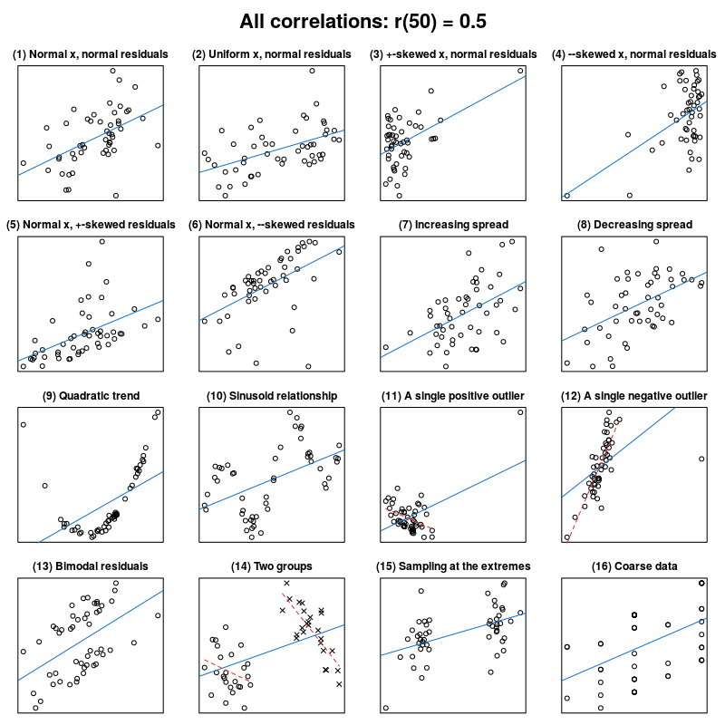
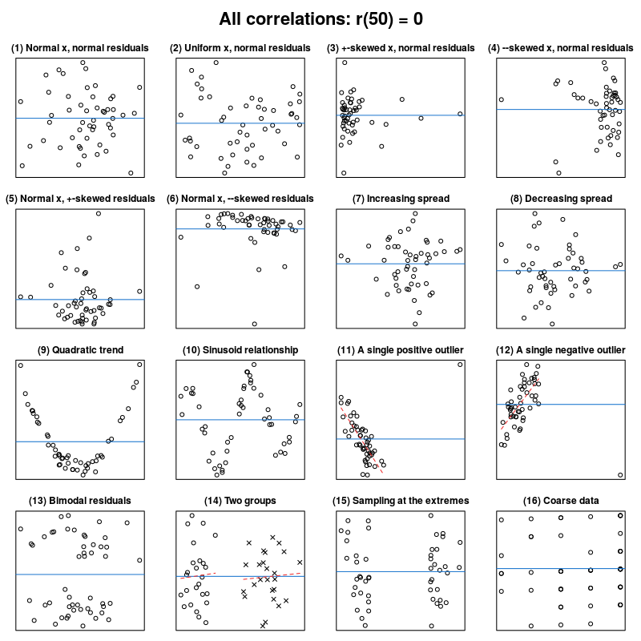
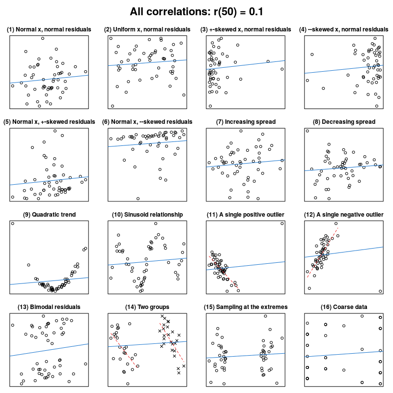

```{r include=FALSE, cache=FALSE}

library("knitr")

### Chunk options ###

## Text results
opts_chunk$set(echo = FALSE, warning = FALSE, message = FALSE, size = 'tiny')

## Code decoration
opts_chunk$set(tidy = FALSE, comment = NA, highlight = TRUE, prompt = FALSE, crop = TRUE)

# ## Cache
# opts_chunk$set(cache = TRUE, cache.path = "knitr_output/cache/")

# ## Plots
# opts_chunk$set(fig.path = "knitr_output/figures/")
opts_chunk$set(fig.align = 'center', out.width = '90%')

### Hooks ###
## Crop plot margins
knit_hooks$set(crop = hook_pdfcrop)

## Reduce font size
## use tinycode = TRUE as chunk option to reduce code font size
# see http://stackoverflow.com/a/39961605
knit_hooks$set(tinycode = function(before, options, envir) {
  if (before) return(paste0("\n \\", options$size, "\n\n"))
  else return("\n\n \\normalsize \n")
  })

```


# Visualisation of data & models is key 

## Always plot data and models


## Don't use statistics blindly: *Visualise*

```{r }

```

\tiny https://janhove.github.io/teaching/2016/11/21/what-correlations-look-like


## Don't use statistics blindly: *Visualise*

```{r }

```

\tiny https://janhove.github.io/teaching/2016/11/21/what-correlations-look-like


## Don't use statistics blindly: *Visualise*

```{r }

```

\tiny https://janhove.github.io/teaching/2016/11/21/what-correlations-look-like


----

> **Plot. Check models. Plot. Check assumptions. Plot.**

\raggedright
\scriptsize [Lavine 2014 *Ecology*](http://dx.doi.org/10.1890/13-1112.1)
\raggedleft


